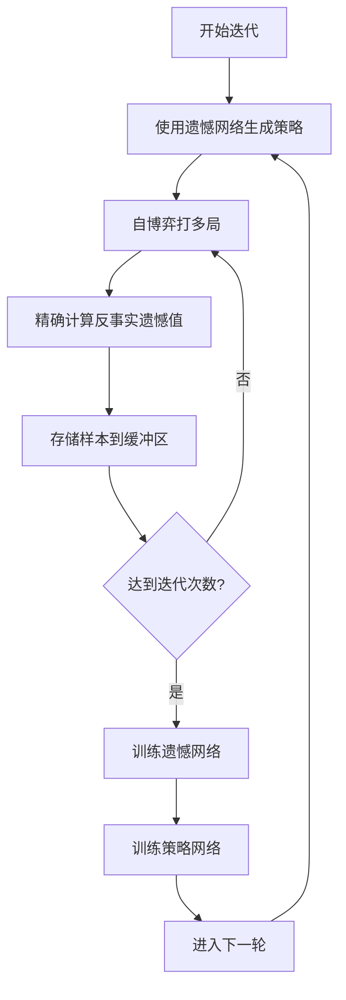
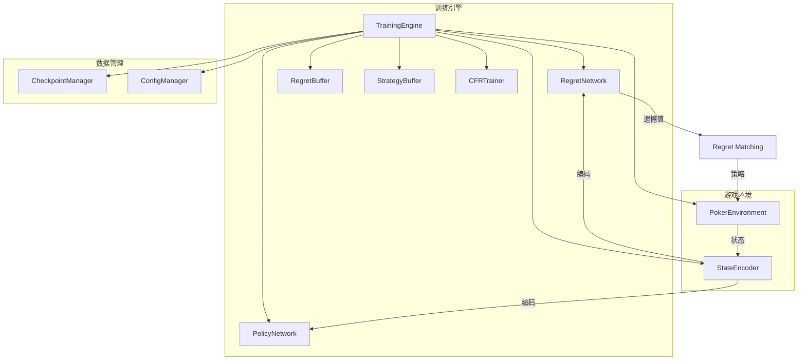
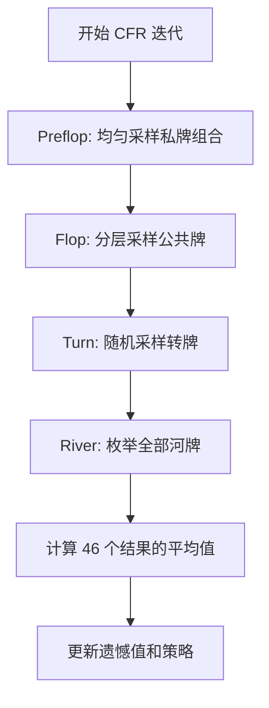

# 设计文档

## 概述

本设计文档描述将当前的混合训练架构重构为纯 Deep CFR 架构的技术方案。Deep CFR（Deep Counterfactual Regret Minimization）是 Facebook AI Research 在 2019 年提出的算法，成功应用于 Libratus 和 Pluribus 等超人类扑克 AI。

### 核心架构变化

| 组件 | 当前架构 | Deep CFR 架构 |
|------|----------|---------------|
| 网络1 | PolicyNetwork（策略网络） | RegretNetwork（遗憾网络） |
| 网络2 | ValueNetwork（价值网络） | PolicyNetwork（策略网络） |
| 训练方式 | Actor-Critic + CFR 混合 | 纯 CFR + 神经网络函数逼近 |
| 策略来源 | 策略网络直接输出 | 遗憾网络 → Regret Matching |
| 数据存储 | 无缓冲区 | 遗憾缓冲区 + 策略缓冲区 |

### Deep CFR 训练流程



## 架构

### 系统架构图



### 模块职责

1. **RegretNetwork（遗憾网络）**
   - 输入：状态编码（370维）
   - 输出：每个动作的遗憾值（4维）
   - 用途：学习即时遗憾值，通过 Regret Matching 生成策略

2. **PolicyNetwork（策略网络）**
   - 输入：状态编码（370维）
   - 输出：动作概率分布（4维，softmax）
   - 用途：学习长期平均策略，用于最终部署

3. **RegretBuffer（遗憾缓冲区）**
   - 存储：(状态编码, 遗憾值, 迭代编号) 三元组
   - 采样：蓄水池采样保持固定大小
   - 用途：训练遗憾网络

4. **StrategyBuffer（策略缓冲区）**
   - 存储：(状态编码, 策略概率, 迭代编号) 三元组
   - 采样：蓄水池采样保持固定大小
   - 用途：训练策略网络

5. **CFRTrainer（CFR 训练器）**
   - 计算反事实遗憾值
   - 执行 Regret Matching
   - 管理迭代计数

## 组件和接口

### 神经网络组件

#### RegretNetwork（遗憾网络）
```python
class RegretNetwork(nn.Module):
    """遗憾网络：预测每个动作的遗憾值。
    
    网络架构：
    - 输入层：370维（状态编码）
    - 隐藏层：[512, 256, 128]，使用ReLU激活函数
    - 输出层：行动空间维度（默认4），无激活函数
    
    注意：输出可以是任意实数（正或负），表示遗憾值。
    """
    
    def __init__(self, input_dim: int = 370, 
                 hidden_dims: List[int] = None, 
                 action_dim: int = 4):
        """初始化遗憾网络。"""
        
    def forward(self, state_encoding: torch.Tensor) -> torch.Tensor:
        """前向传播，返回每个动作的遗憾值。
        
        Returns:
            遗憾值张量，形状为(batch_size, action_dim)
        """
        
    def get_strategy(self, state_encoding: torch.Tensor) -> torch.Tensor:
        """使用 Regret Matching 从遗憾值计算策略。
        
        Regret Matching 算法：
        - 正遗憾值按比例分配概率
        - 所有遗憾值非正时使用均匀分布
        
        Returns:
            策略概率分布，形状为(batch_size, action_dim)
        """
```

#### PolicyNetwork（策略网络）
```python
class PolicyNetwork(nn.Module):
    """策略网络：输出长期平均策略。
    
    网络架构：
    - 输入层：370维（状态编码）
    - 隐藏层：[512, 256, 128]，使用ReLU激活函数
    - 输出层：行动空间维度（默认4），Softmax激活
    """
    
    def __init__(self, input_dim: int = 370, 
                 hidden_dims: List[int] = None, 
                 action_dim: int = 4):
        """初始化策略网络。"""
        
    def forward(self, state_encoding: torch.Tensor) -> torch.Tensor:
        """前向传播，返回行动logits。"""
        
    def get_action_probs(self, state_encoding: torch.Tensor) -> torch.Tensor:
        """获取行动概率分布（应用softmax）。"""
```

### 经验回放缓冲区

#### ReservoirBuffer（蓄水池缓冲区）
```python
class ReservoirBuffer:
    """使用蓄水池采样的经验回放缓冲区。
    
    蓄水池采样确保：
    - 缓冲区大小固定
    - 每个样本被保留的概率相等
    - 内存使用可控
    """
    
    def __init__(self, capacity: int):
        """初始化缓冲区。
        
        Args:
            capacity: 缓冲区最大容量
        """
        
    def add(self, state: np.ndarray, target: np.ndarray, 
            iteration: int) -> None:
        """添加样本到缓冲区。
        
        使用蓄水池采样：
        - 如果缓冲区未满，直接添加
        - 如果缓冲区已满，以 capacity/n 的概率替换随机样本
        
        Args:
            state: 状态编码
            target: 目标值（遗憾值或策略概率）
            iteration: CFR 迭代编号
        """
        
    def sample(self, batch_size: int) -> Tuple[np.ndarray, np.ndarray, np.ndarray]:
        """从缓冲区随机采样。
        
        Returns:
            (states, targets, iterations) 三元组
        """
        
    def __len__(self) -> int:
        """返回当前缓冲区大小。"""
```

### 训练组件

#### DeepCFRTrainer（Deep CFR 训练器）
```python
class DeepCFRTrainer:
    """Deep CFR 训练器 - 实现标准 Deep CFR 算法。
    
    训练流程：
    1. 使用遗憾网络生成策略进行自博弈
    2. 精确计算反事实遗憾值
    3. 存储样本到缓冲区
    4. 批量训练网络
    """
    
    def __init__(self, config: TrainingConfig):
        """初始化 Deep CFR 训练器。"""
        
    def traverse_game_tree(self, state: GameState, 
                           player_id: int,
                           reach_probs: Tuple[float, float]
                           ) -> float:
        """遍历游戏树，计算反事实遗憾值。
        
        使用外部采样 MCCFR：
        - 对当前玩家的所有动作进行遍历
        - 对对手的动作进行采样
        
        Args:
            state: 当前游戏状态
            player_id: 当前遍历的玩家ID
            reach_probs: 两个玩家到达当前状态的概率
            
        Returns:
            当前状态的期望收益
        """
        
    def compute_counterfactual_regrets(self, state: GameState,
                                        player_id: int,
                                        action_values: Dict[int, float],
                                        strategy: np.ndarray
                                        ) -> np.ndarray:
        """计算反事实遗憾值。
        
        反事实遗憾值 = 动作收益 - 当前策略期望收益
        
        Args:
            state: 当前游戏状态
            player_id: 玩家ID
            action_values: 每个动作的收益
            strategy: 当前策略
            
        Returns:
            每个动作的遗憾值数组
        """
        
    def run_cfr_iteration(self) -> Dict[str, float]:
        """执行一次 CFR 迭代。
        
        Returns:
            迭代指标（平均遗憾值等）
        """
        
    def train_networks(self) -> Dict[str, float]:
        """训练遗憾网络和策略网络。
        
        Returns:
            训练指标（损失值等）
        """
```

#### 更新后的 TrainingEngine
```python
class TrainingEngine:
    """训练引擎 - 管理 Deep CFR 训练流程。
    
    主要变化：
    - 移除 ValueNetwork
    - 添加 RegretNetwork
    - 添加 RegretBuffer 和 StrategyBuffer
    - 使用 Deep CFR 训练流程
    """
    
    def __init__(self, config: TrainingConfig):
        """初始化训练引擎。
        
        初始化组件：
        - RegretNetwork（遗憾网络）
        - PolicyNetwork（策略网络）
        - RegretBuffer（遗憾缓冲区）
        - StrategyBuffer（策略缓冲区）
        - DeepCFRTrainer（Deep CFR 训练器）
        """
        
    def train(self, num_iterations: int) -> Dict[str, Any]:
        """执行 Deep CFR 训练。
        
        训练循环：
        1. 执行 cfr_iterations_per_update 次 CFR 迭代
        2. 训练遗憾网络和策略网络
        3. 重复直到达到目标迭代次数
        """
```

### 配置更新

#### TrainingConfig 更新
```python
@dataclass
class TrainingConfig:
    """训练配置参数。
    
    Deep CFR 新增参数：
    - regret_buffer_size: 遗憾缓冲区大小
    - strategy_buffer_size: 策略缓冲区大小
    - cfr_iterations_per_update: 每次网络更新前的 CFR 迭代次数
    - network_train_steps: 每次更新的训练步数
    
    移除参数：
    - cfr_weight: 不再需要混合权重
    """
    learning_rate: float = 0.001
    batch_size: int = 2048  # Deep CFR 通常使用较大批次
    num_episodes: int = 10000
    discount_factor: float = 1.0  # CFR 通常不使用折扣
    network_architecture: List[int] = field(default_factory=lambda: [512, 256, 128])
    checkpoint_interval: int = 1000
    num_parallel_envs: int = 1
    initial_stack: int = 1000
    small_blind: int = 5
    big_blind: int = 10
    entropy_coefficient: float = 0.0  # Deep CFR 通常不需要熵正则化
    max_raises_per_street: int = 4
    
    # Deep CFR 特有参数
    regret_buffer_size: int = 2000000
    strategy_buffer_size: int = 2000000
    cfr_iterations_per_update: int = 1000
    network_train_steps: int = 4000
```

## 数据模型

### RegretSample（遗憾样本）
```python
@dataclass
class RegretSample:
    """遗憾网络训练样本。
    
    Attributes:
        state_encoding: 状态编码向量
        regrets: 每个动作的遗憾值
        iteration: CFR 迭代编号
    """
    state_encoding: np.ndarray
    regrets: np.ndarray
    iteration: int
```

### StrategySample（策略样本）
```python
@dataclass
class StrategySample:
    """策略网络训练样本。
    
    Attributes:
        state_encoding: 状态编码向量
        strategy: 策略概率分布
        iteration: CFR 迭代编号
    """
    state_encoding: np.ndarray
    strategy: np.ndarray
    iteration: int
```

## CFR 采样策略

为了避免遍历完整的游戏树（计算量过大），采用"翻前/翻牌分层随机 + 转牌随机 + 河牌枚举"的采样方式。

### 采样流程



### 各阶段采样策略

#### 1. Preflop（私牌）采样
- **方法**：均匀采样私牌组合
- **说明**：从所有可能的私牌组合中均匀随机选择
- **优化方向**：后续可按 reach 权重采样

#### 2. Flop（翻牌）分层采样
- **方法**：按翻牌纹理分 bucket，先抽 bucket，再在 bucket 内均匀抽 flop
- **Bucket 分类维度**：
  - 是否同花（2张/3张同花）
  - 是否成顺/可成顺
  - 牌面高低（高牌/中牌/低牌）
  - 是否有对子（paired）
  - 是否有 A（A-high）
- **推荐 bucket 数**：30 左右（范围 20~80）
- **优势**：保证覆盖各种翻牌纹理，避免只学到"常见翻牌"

#### 3. Turn（转牌）随机采样
- **方法**：从剩余牌堆中均匀随机抽取 1 张
- **说明**：简单高效，计算量可控

#### 4. River（河牌）枚举
- **方法**：枚举全部剩余河牌（通常 46 张）
- **计算**：对 46 个结果做平均（或按概率加权）
- **优势**：
  - 显著减少 regret 噪声
  - 末端方差下降最大
  - 计算量可控（46 倍放大只发生在河牌阶段）

### Flop Bucket 分类实现

```python
class FlopBucketClassifier:
    """翻牌纹理分类器。
    
    将翻牌分为约 30 个 bucket，用于分层采样。
    """
    
    def __init__(self, num_buckets: int = 30):
        """初始化分类器。"""
        self.num_buckets = num_buckets
        self._build_bucket_mapping()
    
    def classify(self, flop: List[Card]) -> int:
        """将翻牌分类到 bucket。
        
        Args:
            flop: 三张翻牌
            
        Returns:
            bucket 索引
        """
        features = self._extract_features(flop)
        return self._features_to_bucket(features)
    
    def _extract_features(self, flop: List[Card]) -> Dict[str, Any]:
        """提取翻牌特征。
        
        特征包括：
        - flush_count: 同花牌数量（2或3）
        - straight_potential: 顺子潜力（0-3）
        - high_card_count: 高牌数量（T+）
        - is_paired: 是否有对子
        - has_ace: 是否有A
        - connectedness: 连接度（相邻牌数量）
        """
        pass
    
    def _features_to_bucket(self, features: Dict[str, Any]) -> int:
        """将特征映射到 bucket 索引。"""
        pass
    
    def sample_flop_from_bucket(self, bucket: int, 
                                 used_cards: Set[Card]) -> List[Card]:
        """从指定 bucket 中采样一个翻牌。
        
        Args:
            bucket: bucket 索引
            used_cards: 已使用的牌（私牌）
            
        Returns:
            三张翻牌
        """
        pass
```

### 采样策略的优势

1. **计算量可控**：
   - 不需要遍历完整游戏树
   - 46 倍放大只发生在河牌阶段，不是从翻牌开始爆炸

2. **覆盖全面**：
   - 翻牌分层采样保证覆盖各种纹理
   - 避免只学到"常见翻牌"

3. **方差低**：
   - 河牌枚举显著减少 regret 噪声
   - 末端方差下降最大

4. **易于实现**：
   - 各阶段采样策略清晰
   - 可以逐步优化（先跑通再优化）

## 正确性属性

*属性是指在系统的所有有效执行中都应该成立的特征或行为——本质上是关于系统应该做什么的形式化陈述。属性是人类可读规范和机器可验证正确性保证之间的桥梁。*

### 属性 1：遗憾网络输出维度正确性
*对于任何*有效的状态编码输入，遗憾网络的输出维度应该等于动作空间大小（4维）
**验证需求：1.3**

### 属性 2：策略网络输出概率分布有效性
*对于任何*有效的状态编码输入，策略网络的输出应该是有效的概率分布（所有概率非负且和为1，误差在1e-6内）
**验证需求：1.4**

### 属性 3：检查点往返一致性
*对于任何*遗憾网络和策略网络的参数状态，保存为检查点后再加载，应该恢复出等价的网络参数
**验证需求：1.5**

### 属性 4：遗憾值计算正确性
*对于任何*游戏状态、动作收益字典和当前策略，计算的遗憾值应该等于各动作收益减去当前策略的期望收益
**验证需求：2.3**

### 属性 5：缓冲区添加行为（未满）
*对于任何*未满的缓冲区，添加一个样本后，缓冲区大小应该增加1
**验证需求：3.2**

### 属性 6：缓冲区大小上限
*对于任何*已满的缓冲区，添加样本后，缓冲区大小应该保持不变（等于最大容量）
**验证需求：3.3**

### 属性 7：缓冲区采样数量正确性
*对于任何*非空缓冲区和采样请求，返回的样本数量应该等于 min(请求数量, 缓冲区大小)
**验证需求：3.4**

### 属性 8：Regret Matching 输出有效性
*对于任何*遗憾值数组，Regret Matching 的输出应该是有效的概率分布（所有概率非负且和为1）
**验证需求：4.3**

### 属性 9：Regret Matching 正遗憾值比例
*对于任何*包含正遗憾值的数组，Regret Matching 输出的概率应该与正遗憾值成正比
**验证需求：4.3**

### 属性 10：Regret Matching 全非正遗憾值
*对于任何*所有遗憾值都非正的数组，Regret Matching 应该输出均匀分布
**验证需求：4.3**

## 错误处理

### 错误类型

1. **配置错误**
   - 无效的缓冲区大小（非正数）
   - 无效的迭代次数（非正数）
   - 处理：验证配置并返回详细错误信息

2. **缓冲区错误**
   - 从空缓冲区采样
   - 处理：返回空数组或抛出明确异常

3. **检查点兼容性错误**
   - 加载旧格式检查点
   - 处理：检测格式并进行兼容性处理

4. **数值错误**
   - 遗憾值溢出
   - 概率计算下溢
   - 处理：使用数值稳定的实现

## 测试策略

### 双重测试方法

本系统采用单元测试和基于属性的测试相结合的方法：

- **单元测试**：验证特定示例、边缘情况和错误条件
- **基于属性的测试**：验证应该在所有输入上成立的通用属性

### 基于属性的测试

**测试库**：使用 Hypothesis 进行基于属性的测试

**配置要求**：
- 每个基于属性的测试应该运行至少100次迭代
- 每个测试必须用注释明确引用设计文档中的正确性属性
- 注释格式：`# Feature: deep-cfr-refactor, Property {编号}: {属性文本}`

**属性测试覆盖**：

1. **网络输出属性**（属性1-2）
   - 生成随机状态编码，验证输出维度和概率分布有效性

2. **检查点属性**（属性3）
   - 生成随机网络参数，验证往返一致性

3. **遗憾值计算属性**（属性4）
   - 生成随机动作收益和策略，验证遗憾值计算

4. **缓冲区属性**（属性5-7）
   - 生成随机样本，验证缓冲区行为

5. **Regret Matching 属性**（属性8-10）
   - 生成随机遗憾值，验证 Regret Matching 输出

### 单元测试

单元测试覆盖以下方面：

1. **网络初始化**
   - 验证遗憾网络和策略网络正确创建
   - 验证网络参数非空

2. **训练流程**
   - 验证 CFR 迭代执行
   - 验证样本收集到缓冲区
   - 验证网络训练

3. **检查点兼容性**
   - 验证加载旧格式检查点不抛出异常

## 实现注意事项

### 遗憾网络 vs 价值网络

| 方面 | 价值网络（旧） | 遗憾网络（新） |
|------|---------------|---------------|
| 输出维度 | 1（状态价值） | 4（每个动作的遗憾值） |
| 输出激活 | Tanh（[-1, 1]） | 无（任意实数） |
| 用途 | 计算优势函数 | 生成策略 + 训练目标 |
| 损失函数 | MSE（与折扣奖励） | MSE（与 CFR 遗憾值） |

### Regret Matching 实现

```python
def regret_matching(regrets: np.ndarray) -> np.ndarray:
    """将遗憾值转换为策略概率。
    
    算法：
    1. 取正遗憾值：positive_regrets = max(regrets, 0)
    2. 如果正遗憾值和 > 0：strategy = positive_regrets / sum
    3. 否则：strategy = uniform distribution
    """
    positive_regrets = np.maximum(regrets, 0)
    regret_sum = np.sum(positive_regrets)
    
    if regret_sum > 0:
        return positive_regrets / regret_sum
    else:
        return np.ones(len(regrets)) / len(regrets)
```

### 蓄水池采样实现

```python
def reservoir_add(buffer: List, sample: Any, n: int, capacity: int) -> None:
    """蓄水池采样添加样本。
    
    Args:
        buffer: 缓冲区列表
        sample: 要添加的样本
        n: 已见过的样本总数（包括当前样本）
        capacity: 缓冲区容量
    """
    if len(buffer) < capacity:
        buffer.append(sample)
    else:
        # 以 capacity/n 的概率替换随机位置
        j = random.randint(0, n - 1)
        if j < capacity:
            buffer[j] = sample
```

### 训练循环伪代码

```python
def train_deep_cfr(num_iterations: int):
    for t in range(num_iterations):
        # 1. 执行 CFR 迭代，收集样本
        for _ in range(cfr_iterations_per_update):
            # 遍历游戏树
            traverse_game_tree(initial_state, player=0)
            traverse_game_tree(initial_state, player=1)
        
        # 2. 训练遗憾网络
        for _ in range(network_train_steps):
            batch = regret_buffer.sample(batch_size)
            loss = mse_loss(regret_net(batch.states), batch.regrets)
            loss.backward()
            optimizer.step()
        
        # 3. 训练策略网络
        for _ in range(network_train_steps):
            batch = strategy_buffer.sample(batch_size)
            loss = cross_entropy_loss(policy_net(batch.states), batch.strategies)
            loss.backward()
            optimizer.step()
```

### 与现有代码的兼容性

1. **检查点格式**：新检查点包含 `regret_network` 和 `policy_network`，旧检查点包含 `policy_network` 和 `value_network`
2. **配置参数**：新增参数有默认值，旧配置文件可以正常加载
3. **策略分析器**：需要更新为从策略网络获取策略，而非从旧的策略网络
