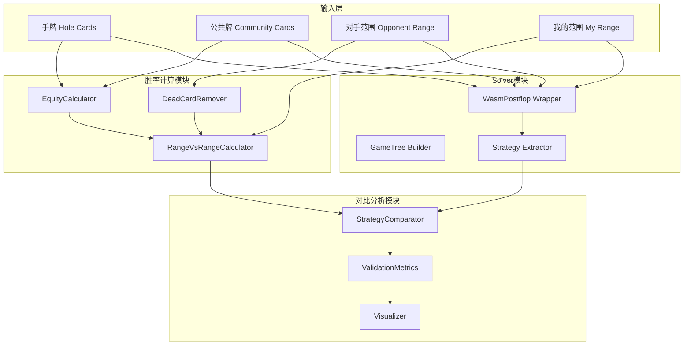

# 设计文档

## 概述

本实验设计一个验证框架，用于测试河牌阶段胜率标量是否能够替代传统Solver所需的完整信息。实验将对比两种方法：

1. **胜率方法**：使用"手牌VS对手范围"和"范围VS范围"的胜率标量
2. **Solver方法**：使用wasm-postflop计算的纳什均衡策略

核心假设是：在河牌阶段，胜率标量包含了足够的信息来近似最优策略。

## 架构



## 组件和接口

### 1. DeadCardRemover（死牌移除器）

```python
class DeadCardRemover:
    """从范围中移除与已知牌冲突的手牌组合"""
    
    def remove_dead_cards(
        self,
        range_weights: Dict[Tuple[Card, Card], float],
        dead_cards: List[Card]
    ) -> Dict[Tuple[Card, Card], float]:
        """
        从范围中移除包含死牌的组合
        
        Args:
            range_weights: 手牌组合到权重的映射
            dead_cards: 死牌列表（我的手牌 + 公共牌）
            
        Returns:
            移除死牌后的范围权重
        """
        pass
```

### 2. RangeVsRangeCalculator（范围对抗计算器）

```python
class RangeVsRangeCalculator:
    """计算范围VS范围的胜率"""
    
    def calculate_hand_vs_range_equity(
        self,
        hole_cards: Tuple[Card, Card],
        community_cards: List[Card],
        opponent_range: Dict[Tuple[Card, Card], float]
    ) -> float:
        """
        计算单个手牌对抗对手范围的胜率
        
        Args:
            hole_cards: 我的手牌
            community_cards: 5张公共牌
            opponent_range: 对手范围（已移除死牌）
            
        Returns:
            胜率标量 [0, 1]
        """
        pass
    
    def calculate_range_vs_range_equity(
        self,
        my_range: Dict[Tuple[Card, Card], float],
        opponent_range: Dict[Tuple[Card, Card], float],
        community_cards: List[Card]
    ) -> Dict[Tuple[Card, Card], float]:
        """
        计算我的范围中每个手牌对抗对手范围的胜率
        
        Args:
            my_range: 我的范围
            opponent_range: 对手范围
            community_cards: 5张公共牌
            
        Returns:
            每个手牌组合的胜率映射
        """
        pass
```

### 3. WasmPostflopWrapper（Solver封装器）

```python
class WasmPostflopWrapper:
    """wasm-postflop Solver的Python封装"""
    
    def __init__(self, config: SolverConfig):
        """
        初始化Solver
        
        Args:
            config: Solver配置（底池、筹码、下注选项等）
        """
        pass
    
    def solve(
        self,
        community_cards: List[Card],
        my_range: Dict[Tuple[Card, Card], float],
        opponent_range: Dict[Tuple[Card, Card], float],
        iterations: int = 1000
    ) -> SolverResult:
        """
        运行Solver计算纳什均衡
        
        Args:
            community_cards: 公共牌
            my_range: 我的范围
            opponent_range: 对手范围
            iterations: 迭代次数
            
        Returns:
            Solver结果
        """
        pass
    
    def get_strategy(
        self,
        node_path: List[str]
    ) -> Dict[Tuple[Card, Card], Dict[str, float]]:
        """
        获取指定节点的策略
        
        Args:
            node_path: 节点路径（如 ["check", "bet:50"]）
            
        Returns:
            每个手牌的动作概率分布
        """
        pass
```

### 4. StrategyComparator（策略对比器）

```python
class StrategyComparator:
    """对比胜率方法和Solver方法的策略"""
    
    def equity_to_strategy(
        self,
        equity_vector: Dict[Tuple[Card, Card], float],
        pot_size: float,
        bet_size: float
    ) -> Dict[Tuple[Card, Card], Dict[str, float]]:
        """
        将胜率向量转换为简化策略
        
        基于胜率阈值决定动作：
        - equity < fold_threshold: fold
        - fold_threshold <= equity < raise_threshold: call
        - equity >= raise_threshold: raise
        
        Args:
            equity_vector: 胜率向量
            pot_size: 底池大小
            bet_size: 下注大小
            
        Returns:
            简化策略
        """
        pass
    
    def compare_strategies(
        self,
        equity_strategy: Dict[Tuple[Card, Card], Dict[str, float]],
        solver_strategy: Dict[Tuple[Card, Card], Dict[str, float]]
    ) -> ComparisonResult:
        """
        对比两种策略
        
        Args:
            equity_strategy: 基于胜率的策略
            solver_strategy: Solver策略
            
        Returns:
            对比结果
        """
        pass
```

### 5. ValidationMetrics（验证指标）

```python
@dataclass
class ValidationMetrics:
    """验证指标"""
    
    # 策略差异
    total_variation_distance: float  # 总变差距离
    kl_divergence: float  # KL散度
    action_agreement_rate: float  # 动作一致率
    
    # EV差异
    ev_correlation: float  # EV相关系数
    ev_rmse: float  # EV均方根误差
    
    # 胜率-策略关系
    equity_strategy_correlation: float  # 胜率与策略的相关性
```

## 数据模型

### SolverConfig（Solver配置）

```python
@dataclass
class SolverConfig:
    """Solver配置"""
    pot_size: float  # 底池大小
    effective_stack: float  # 有效筹码
    oop_bet_sizes: List[float]  # OOP下注尺寸（占底池比例）
    ip_bet_sizes: List[float]  # IP下注尺寸
    oop_raise_sizes: List[float]  # OOP加注尺寸
    ip_raise_sizes: List[float]  # IP加注尺寸
    all_in_threshold: float = 0.67  # 全押阈值
```

### SolverResult（Solver结果）

```python
@dataclass
class SolverResult:
    """Solver计算结果"""
    exploitability: float  # 可利用度
    iterations: int  # 实际迭代次数
    root_ev: Tuple[float, float]  # 根节点EV (OOP, IP)
    strategies: Dict[str, Dict[Tuple[Card, Card], Dict[str, float]]]  # 各节点策略
```

### ComparisonResult（对比结果）

```python
@dataclass
class ComparisonResult:
    """策略对比结果"""
    metrics: ValidationMetrics
    per_hand_diff: Dict[Tuple[Card, Card], float]  # 每手牌的策略差异
    action_distribution: Dict[str, Tuple[float, float]]  # 动作分布对比
```

### ExperimentScenario（实验场景）

```python
@dataclass
class ExperimentScenario:
    """实验场景配置"""
    name: str
    community_cards: List[Card]
    my_range: Dict[Tuple[Card, Card], float]
    opponent_range: Dict[Tuple[Card, Card], float]
    solver_config: SolverConfig
```


## 正确性属性

*A property is a characteristic or behavior that should hold true across all valid executions of a system-essentially, a formal statement about what the system should do. Properties serve as the bridge between human-readable specifications and machine-verifiable correctness guarantees.*

基于需求分析，以下是本系统需要验证的正确性属性：

### Property 1: 胜率计算正确性与范围约束

*For any* 手牌组合、5张公共牌和对手范围，计算出的胜率值必须在[0, 1]范围内，且与通过枚举所有对手手牌计算的结果一致（误差小于1e-6）。

**Validates: Requirements 1.1, 1.3**

### Property 2: 死牌移除正确性

*For any* 范围和死牌列表，移除死牌后的范围不包含任何与死牌冲突的手牌组合，且所有不冲突的组合都被保留。

**Validates: Requirements 1.2, 2.2**

### Property 3: 范围VS范围计算完整性

*For any* 我的范围、对手范围和公共牌，返回的胜率向量必须包含我的范围中所有有效（不与公共牌冲突）的手牌组合，且每个胜率值在[0, 1]范围内。

**Validates: Requirements 2.1, 2.3**

### Property 4: 策略概率归一化

*For any* 从Solver提取的策略或从胜率转换的策略，每个手牌的动作概率之和必须等于1（误差小于1e-6），且每个动作概率在[0, 1]范围内。

**Validates: Requirements 3.2, 4.1**

### Property 5: 策略差异度量数学性质

*For any* 两个策略分布，计算的总变差距离必须在[0, 1]范围内，且当两个策略相同时距离为0。

**Validates: Requirements 4.2**

### Property 6: 批量实验结果完整性

*For any* 批量实验配置，运行完成后每个场景都必须有对应的结果记录，且结果数量等于场景数量。

**Validates: Requirements 5.2**

## 错误处理

### 输入验证错误

| 错误类型 | 触发条件 | 处理方式 |
|---------|---------|---------|
| InvalidCardError | 牌面无效（如rank超出2-14范围） | 抛出异常，提示有效范围 |
| DuplicateCardError | 手牌或公共牌中有重复 | 抛出异常，列出重复的牌 |
| InvalidRangeError | 范围权重为负或全为0 | 抛出异常，提示有效权重范围 |
| InsufficientCardsError | 公共牌不足5张（河牌阶段） | 抛出异常，提示需要5张公共牌 |

### Solver错误

| 错误类型 | 触发条件 | 处理方式 |
|---------|---------|---------|
| SolverTimeoutError | Solver计算超时 | 返回部分结果，标记未收敛 |
| SolverConfigError | 配置无效（如负数底池） | 抛出异常，提示配置问题 |
| SolverMemoryError | 内存不足 | 建议减少范围大小或下注选项 |

## 测试策略

### 单元测试

1. **DeadCardRemover测试**
   - 测试基本死牌移除功能
   - 测试边界情况（空范围、全部被移除）
   - 测试权重保持正确

2. **RangeVsRangeCalculator测试**
   - 测试单手牌VS范围计算
   - 测试范围VS范围计算
   - 测试特殊情况（坚果牌、空气牌）

3. **StrategyComparator测试**
   - 测试胜率到策略的转换
   - 测试策略差异度量计算
   - 测试相同策略的差异为0

### 属性测试

使用Hypothesis库进行属性测试：

1. **胜率范围属性测试**
   - 生成随机手牌、公共牌、对手范围
   - 验证胜率在[0, 1]范围内

2. **死牌移除属性测试**
   - 生成随机范围和死牌
   - 验证移除后无冲突

3. **策略归一化属性测试**
   - 生成随机策略转换输入
   - 验证输出概率之和为1

4. **度量对称性属性测试**
   - 生成随机策略对
   - 验证总变差距离的对称性

### 集成测试

1. **端到端验证流程测试**
   - 使用预定义场景运行完整流程
   - 验证输出格式和内容正确

2. **Solver集成测试**
   - 测试wasm-postflop调用
   - 验证策略提取正确

## 实验设计

### 实验场景

设计以下类型的实验场景：

1. **干燥牌面（Dry Board）**
   - 如：K♠7♦2♣4♥9♠
   - 特点：连接性低，抽牌少

2. **湿润牌面（Wet Board）**
   - 如：J♠T♠9♦8♣7♥
   - 特点：连接性高，多种成牌可能

3. **配对牌面（Paired Board）**
   - 如：K♠K♦7♣3♥2♠
   - 特点：葫芦和四条可能

4. **同花牌面（Flush Board）**
   - 如：A♠K♠7♠3♠2♦
   - 特点：同花已成

### 范围配置

1. **宽范围 vs 宽范围**
   - 双方都有较宽的范围

2. **窄范围 vs 宽范围**
   - 一方范围较窄（如3bet范围）

3. **极化范围 vs 凝聚范围**
   - 测试不同范围结构的影响

### 评估指标

1. **策略相似度**
   - 动作一致率（最高概率动作相同的比例）
   - 总变差距离（策略分布差异）

2. **EV相关性**
   - 胜率与Solver EV的相关系数
   - EV预测误差

3. **可利用度对比**
   - 基于胜率策略的可利用度
   - Solver策略的可利用度
