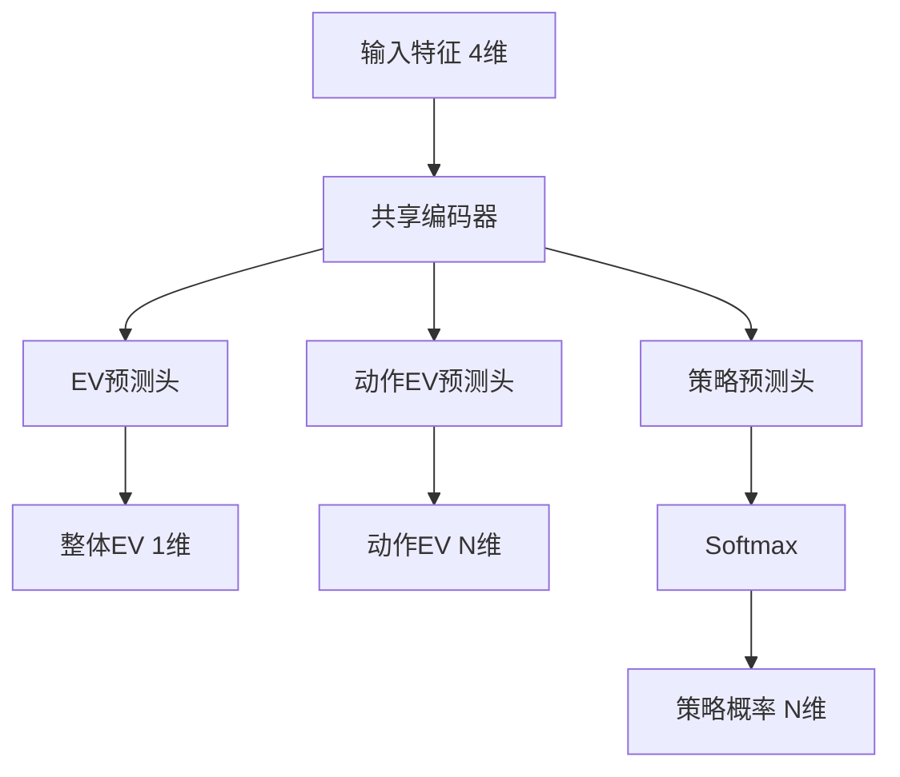

# 设计文档

## 概述

本设计描述了一个用于预测扑克场景EV和策略的神经网络系统。该网络接收4个标量特征作为输入，输出整体EV、每个动作的EV以及动作策略概率分布。系统使用PyTorch实现，支持GPU加速训练。

## 架构

### 整体架构



### 网络结构

采用多任务学习架构，共享底层特征提取器，分别输出三个预测目标：

1. **共享编码器**: 将4维输入映射到高维特征空间
2. **EV预测头**: 预测整体期望值（标量）
3. **动作EV预测头**: 预测每个动作的期望值（N维向量）
4. **策略预测头**: 预测动作概率分布（N维向量，经softmax归一化）

## 组件和接口

### 1. EVPredictionNetwork（神经网络模型）

```python
class EVPredictionNetwork(nn.Module):
    def __init__(self, num_actions: int = 5, hidden_dim: int = 64):
        """
        参数:
            num_actions: 动作数量（默认5：Check, Bet33, Bet50, Bet75, Bet120）
            hidden_dim: 隐藏层维度
        """
    
    def forward(self, x: torch.Tensor) -> Tuple[torch.Tensor, torch.Tensor, torch.Tensor]:
        """
        参数:
            x: 输入特征 [batch_size, 4]
               - x[:, 0]: hero_equity
               - x[:, 1]: range_equity  
               - x[:, 2]: solver_equity
               - x[:, 3]: eqr
        
        返回:
            ev: 整体EV预测 [batch_size, 1]
            action_ev: 动作EV预测 [batch_size, num_actions]
            strategy: 策略概率 [batch_size, num_actions]
        """
```

### 2. EVDataset（数据集类）

```python
class EVDataset(Dataset):
    def __init__(self, data_dir: str, max_files: int = None):
        """
        参数:
            data_dir: 验证数据目录路径
            max_files: 最大加载文件数（用于调试）
        """
    
    def __getitem__(self, idx: int) -> Tuple[torch.Tensor, torch.Tensor, torch.Tensor, torch.Tensor]:
        """
        返回:
            features: 输入特征 [4]
            ev: 目标EV [1]
            action_ev: 目标动作EV [num_actions]
            strategy: 目标策略 [num_actions]
        """
```

### 3. EVTrainer（训练器类）

```python
class EVTrainer:
    def __init__(
        self,
        model: EVPredictionNetwork,
        learning_rate: float = 1e-3,
        ev_weight: float = 1.0,
        action_ev_weight: float = 1.0,
        strategy_weight: float = 1.0
    ):
        """
        参数:
            model: 神经网络模型
            learning_rate: 学习率
            ev_weight: EV损失权重
            action_ev_weight: 动作EV损失权重
            strategy_weight: 策略损失权重
        """
    
    def train_epoch(self, dataloader: DataLoader) -> Dict[str, float]:
        """训练一个epoch，返回各项损失"""
    
    def evaluate(self, dataloader: DataLoader) -> Dict[str, float]:
        """评估模型，返回各项指标"""
    
    def save_checkpoint(self, path: str):
        """保存模型检查点"""
    
    def load_checkpoint(self, path: str):
        """加载模型检查点"""
```

## 数据模型

### 输入特征

| 特征名 | 类型 | 范围 | 描述 |
|--------|------|------|------|
| hero_equity | float | [0, 1] | 英雄手牌相对于对手范围的胜率 |
| range_equity | float | [0, 1] | 范围对范围的整体胜率 |
| solver_equity | float | [0, 1] | Solver计算的权益 |
| eqr | float | [0, 2+] | 权益实现率 |

### 输出目标

| 输出名 | 类型 | 范围 | 描述 |
|--------|------|------|------|
| ev | float | [-∞, +∞] | 整体期望值（以底池百分比计） |
| action_ev | float[N] | [-∞, +∞] | 每个动作的期望值 |
| strategy | float[N] | [0, 1] | 每个动作的选择概率，和为1 |

### 动作定义

默认动作集（可配置）：
- Check:0 - 过牌
- Bet:33 - 下注33%底池
- Bet:50 - 下注50%底池
- Bet:75 - 下注75%底池
- Bet:120 - 下注120%底池


## 正确性属性

*属性是系统在所有有效执行中应该保持为真的特征或行为——本质上是关于系统应该做什么的形式化陈述。属性作为人类可读规范和机器可验证正确性保证之间的桥梁。*

### Property 1: 网络输出维度正确性

*对于任意* 4维输入张量和任意动作数量N，网络应该输出：
- 整体EV: [batch_size, 1] 维度
- 动作EV: [batch_size, N] 维度
- 策略: [batch_size, N] 维度

**Validates: Requirements 1.1, 1.2, 1.3, 6.2, 6.3**

### Property 2: 策略概率归一化

*对于任意* 有效的4维输入，网络输出的策略概率向量之和应该等于1.0（误差范围±0.001）

**Validates: Requirements 1.4, 6.4**

### Property 3: 模型保存/加载往返一致性

*对于任意* 训练后的模型状态，保存到文件后再加载，模型的所有参数应该与保存前完全一致

**Validates: Requirements 4.2**

### Property 4: 数据解析往返一致性

*对于任意* 有效的场景数据，序列化为JSON后再解析，提取的特征和目标值应该与原始数据一致

**Validates: Requirements 2.1**

## 错误处理

### 输入验证

1. **无效输入维度**: 如果输入不是4维，抛出 `ValueError`
2. **NaN/Inf值**: 在数据加载时检测并跳过，记录警告日志
3. **文件不存在**: 加载模型时如果文件不存在，抛出 `FileNotFoundError` 并附带清晰的错误信息

### 训练异常

1. **梯度爆炸**: 使用梯度裁剪（gradient clipping）防止
2. **损失为NaN**: 检测并提前终止训练，报告错误

## 测试策略

### 单元测试

1. 测试网络前向传播的输出形状
2. 测试数据集加载和索引
3. 测试损失函数计算
4. 测试模型保存/加载功能

### 属性测试

使用 `hypothesis` 库进行属性测试：

1. **Property 1 测试**: 生成随机batch_size和num_actions，验证输出维度
2. **Property 2 测试**: 生成随机输入特征，验证策略概率和为1
3. **Property 3 测试**: 生成随机模型参数，验证保存/加载一致性
4. **Property 4 测试**: 生成随机场景数据，验证JSON往返一致性

每个属性测试配置运行至少100次迭代。

### 测试框架

- 单元测试: `pytest`
- 属性测试: `hypothesis`
- 测试标注格式: `**Feature: ev-prediction-network, Property {number}: {property_text}**`
