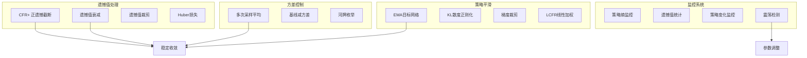
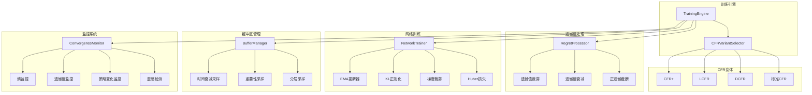

# 设计文档

## 概述

本设计文档描述了改进Deep CFR训练中策略网络收敛方向控制的技术方案。通过引入CFR+/LCFR/DCFR等先进变体、改进遗憾值累积方式、降低采样方差、平滑策略更新、以及增强监控能力，确保策略网络稳定收敛到近似纳什均衡。

### 问题分析

当前河牌训练中策略网络收敛方向难以控制的主要原因：

1. **遗憾值累积不稳定**
   - 当前使用 `accumulated_regrets = predicted_regrets + instant_regrets`
   - 负遗憾值持续累积可能导致策略过度偏向某些动作
   - 缺乏遗憾值衰减机制，历史遗憾值影响过大

2. **采样方差过大**
   - 外部采样MCCFR的方差较大
   - 单次采样的估计值波动剧烈

3. **策略更新不平滑**
   - 缓冲区中的样本来自不同迭代，目标分布不断变化
   - 缺乏对策略变化幅度的约束
   - 梯度可能过大导致参数剧烈变化

4. **缺乏收敛监控**
   - 无法及时发现策略震荡
   - 难以诊断收敛问题

### 解决方案概览



## 架构

### 系统架构图



### 模块职责

1. **CFRVariantSelector（CFR变体选择器）**
   - 根据配置选择CFR变体
   - 提供统一的遗憾值计算接口

2. **RegretProcessor（遗憾值处理器）**
   - 正遗憾值截断（CFR+）
   - 遗憾值衰减
   - 遗憾值裁剪

3. **NetworkTrainer（网络训练器）**
   - EMA目标网络更新
   - KL散度正则化
   - 梯度裁剪
   - Huber损失计算

4. **BufferManager（缓冲区管理器）**
   - 时间衰减采样
   - 重要性采样
   - 分层采样
   - 过旧样本清理

5. **ConvergenceMonitor（收敛监控器）**
   - 策略熵计算
   - 遗憾值统计
   - 策略变化监控
   - 震荡检测与告警

## 组件和接口

### CFR变体选择器

```python
class CFRVariant(Enum):
    """CFR变体枚举。"""
    STANDARD = "standard"  # 标准CFR
    CFR_PLUS = "cfr_plus"  # CFR+
    LCFR = "lcfr"          # Linear CFR
    DCFR = "dcfr"          # Discounted CFR


class CFRVariantConfig:
    """CFR变体配置。
    
    Attributes:
        variant: CFR变体类型
        regret_floor: 遗憾值下限（CFR+使用0）
        discount_alpha: DCFR的alpha参数
        discount_beta: DCFR的beta参数
        discount_gamma: DCFR的gamma参数
    """
    variant: CFRVariant = CFRVariant.CFR_PLUS
    regret_floor: float = 0.0
    discount_alpha: float = 1.5
    discount_beta: float = 0.0
    discount_gamma: float = 2.0
```

### 遗憾值处理器

```python
class RegretProcessor:
    """遗憾值处理器。
    
    提供遗憾值的截断、衰减、裁剪等处理功能。
    """
    
    def __init__(self, config: RegretProcessorConfig):
        """初始化遗憾值处理器。
        
        Args:
            config: 处理器配置
        """
        
    def truncate_positive(self, regrets: np.ndarray) -> np.ndarray:
        """正遗憾值截断（CFR+）。
        
        将负遗憾值截断为0，只保留正遗憾值。
        
        Args:
            regrets: 原始遗憾值数组
            
        Returns:
            截断后的遗憾值数组（所有值非负）
        """
        
    def apply_decay(self, regrets: np.ndarray, 
                    decay_factor: float) -> np.ndarray:
        """应用遗憾值衰减。
        
        Args:
            regrets: 遗憾值数组
            decay_factor: 衰减因子（0-1之间）
            
        Returns:
            衰减后的遗憾值数组
        """
        
    def clip_regrets(self, regrets: np.ndarray, 
                     max_value: float) -> np.ndarray:
        """裁剪遗憾值。
        
        将遗憾值的绝对值限制在阈值内。
        
        Args:
            regrets: 遗憾值数组
            max_value: 最大绝对值
            
        Returns:
            裁剪后的遗憾值数组
        """
        
    def compute_lcfr_weight(self, iteration: int) -> float:
        """计算LCFR线性权重。
        
        权重与迭代次数成正比。
        
        Args:
            iteration: 当前迭代次数
            
        Returns:
            线性权重
        """
        
    def compute_dcfr_discount(self, iteration: int, 
                               current_iteration: int) -> float:
        """计算DCFR折扣因子。
        
        Args:
            iteration: 样本的迭代次数
            current_iteration: 当前迭代次数
            
        Returns:
            折扣因子
        """
```

### 网络训练器

```python
class NetworkTrainerConfig:
    """网络训练器配置。
    
    Attributes:
        use_huber_loss: 是否使用Huber损失
        huber_delta: Huber损失的delta参数
        use_ema: 是否使用EMA更新
        ema_decay: EMA衰减率
        kl_coefficient: KL散度正则化系数
        gradient_clip_norm: 梯度裁剪范数
    """
    use_huber_loss: bool = True
    huber_delta: float = 1.0
    use_ema: bool = True
    ema_decay: float = 0.995
    kl_coefficient: float = 0.01
    gradient_clip_norm: float = 1.0


class NetworkTrainer:
    """网络训练器。
    
    提供改进的网络训练功能。
    """
    
    def __init__(self, config: NetworkTrainerConfig):
        """初始化网络训练器。"""
        
    def compute_huber_loss(self, predictions: torch.Tensor,
                           targets: torch.Tensor) -> torch.Tensor:
        """计算Huber损失。
        
        Huber损失在误差较小时使用MSE，误差较大时使用MAE，
        减少异常值的影响。
        
        Args:
            predictions: 预测值
            targets: 目标值
            
        Returns:
            Huber损失值
        """
        
    def compute_kl_divergence(self, p: torch.Tensor, 
                               q: torch.Tensor) -> torch.Tensor:
        """计算KL散度。
        
        KL(p||q) = sum(p * log(p/q))
        
        Args:
            p: 概率分布P
            q: 概率分布Q
            
        Returns:
            KL散度值
        """
        
    def update_ema(self, target_network: nn.Module,
                   source_network: nn.Module) -> None:
        """使用EMA更新目标网络。
        
        target = decay * target + (1 - decay) * source
        
        Args:
            target_network: 目标网络
            source_network: 源网络
        """
        
    def clip_gradients(self, network: nn.Module) -> float:
        """裁剪梯度。
        
        Args:
            network: 神经网络
            
        Returns:
            裁剪前的梯度范数
        """
```

### 缓冲区管理器

```python
class BufferManagerConfig:
    """缓冲区管理器配置。
    
    Attributes:
        time_decay_factor: 时间衰减因子
        importance_threshold: 重要性阈值
        max_sample_age: 最大样本年龄（迭代次数）
        stratified_sampling: 是否使用分层采样
    """
    time_decay_factor: float = 0.99
    importance_threshold: float = 0.1
    max_sample_age: int = 10000
    stratified_sampling: bool = True


class BufferManager:
    """缓冲区管理器。
    
    提供改进的缓冲区采样和管理功能。
    """
    
    def __init__(self, config: BufferManagerConfig):
        """初始化缓冲区管理器。"""
        
    def sample_with_time_decay(self, buffer: ReservoirBuffer,
                                batch_size: int,
                                current_iteration: int) -> Tuple:
        """使用时间衰减采样。
        
        近期样本有更高的采样概率。
        
        Args:
            buffer: 缓冲区
            batch_size: 批次大小
            current_iteration: 当前迭代次数
            
        Returns:
            采样的(states, targets, iterations)
        """
        
    def sample_stratified(self, buffer: ReservoirBuffer,
                          batch_size: int,
                          stage_key: str) -> Tuple:
        """分层采样。
        
        确保不同游戏阶段的样本均衡。
        
        Args:
            buffer: 缓冲区
            batch_size: 批次大小
            stage_key: 阶段键名
            
        Returns:
            采样的(states, targets, iterations)
        """
        
    def cleanup_old_samples(self, buffer: ReservoirBuffer,
                            current_iteration: int) -> int:
        """清理过旧样本。
        
        Args:
            buffer: 缓冲区
            current_iteration: 当前迭代次数
            
        Returns:
            清理的样本数量
        """
```

### 收敛监控器

```python
class ConvergenceMonitorConfig:
    """收敛监控器配置。
    
    Attributes:
        entropy_window: 熵值监控窗口大小
        oscillation_threshold: 震荡检测阈值
        kl_warning_threshold: KL散度警告阈值
        monitor_interval: 监控间隔（迭代次数）
    """
    entropy_window: int = 100
    oscillation_threshold: float = 0.1
    kl_warning_threshold: float = 0.5
    monitor_interval: int = 1000


class ConvergenceMonitor:
    """收敛监控器。
    
    监控训练过程中的收敛状态。
    """
    
    def __init__(self, config: ConvergenceMonitorConfig):
        """初始化收敛监控器。"""
        
    def compute_entropy(self, strategy: np.ndarray) -> float:
        """计算策略熵。
        
        H(p) = -sum(p * log(p))
        
        Args:
            strategy: 策略概率分布
            
        Returns:
            熵值
        """
        
    def compute_regret_stats(self, regrets: np.ndarray) -> Dict[str, float]:
        """计算遗憾值统计信息。
        
        Args:
            regrets: 遗憾值数组
            
        Returns:
            包含均值、方差、最大值的字典
        """
        
    def detect_oscillation(self, entropy_history: List[float]) -> bool:
        """检测策略震荡。
        
        通过分析熵值历史检测是否存在震荡。
        
        Args:
            entropy_history: 熵值历史列表
            
        Returns:
            是否检测到震荡
        """
        
    def get_convergence_report(self) -> Dict[str, Any]:
        """获取收敛报告。
        
        Returns:
            包含各项监控指标的报告
        """
```

## 数据模型

### 配置数据模型

```python
@dataclass
class ConvergenceControlConfig:
    """收敛控制总配置。
    
    Attributes:
        cfr_variant: CFR变体配置
        regret_processor: 遗憾值处理器配置
        network_trainer: 网络训练器配置
        buffer_manager: 缓冲区管理器配置
        convergence_monitor: 收敛监控器配置
    """
    cfr_variant: CFRVariantConfig = field(default_factory=CFRVariantConfig)
    regret_processor: RegretProcessorConfig = field(default_factory=RegretProcessorConfig)
    network_trainer: NetworkTrainerConfig = field(default_factory=NetworkTrainerConfig)
    buffer_manager: BufferManagerConfig = field(default_factory=BufferManagerConfig)
    convergence_monitor: ConvergenceMonitorConfig = field(default_factory=ConvergenceMonitorConfig)


@dataclass
class RegretProcessorConfig:
    """遗憾值处理器配置。
    
    Attributes:
        use_positive_truncation: 是否使用正遗憾截断
        decay_factor: 遗憾值衰减因子
        clip_threshold: 遗憾值裁剪阈值
    """
    use_positive_truncation: bool = True
    decay_factor: float = 0.99
    clip_threshold: float = 100.0
```

### 监控数据模型

```python
@dataclass
class ConvergenceMetrics:
    """收敛指标。
    
    Attributes:
        iteration: 迭代次数
        avg_entropy: 平均策略熵
        regret_mean: 遗憾值均值
        regret_std: 遗憾值标准差
        regret_max: 遗憾值最大值
        policy_kl: 策略KL散度
        is_oscillating: 是否震荡
    """
    iteration: int
    avg_entropy: float
    regret_mean: float
    regret_std: float
    regret_max: float
    policy_kl: float
    is_oscillating: bool
```

## 正确性属性

*属性是指在系统的所有有效执行中都应该成立的特征或行为——本质上是关于系统应该做什么的形式化陈述。属性是人类可读规范和机器可验证正确性保证之间的桥梁。*

### 属性 1：正遗憾值截断保证非负
*对于任何*遗憾值数组，应用正遗憾值截断后，所有元素应该非负
**验证需求：1.1, 6.2**

### 属性 2：遗憾值衰减正确性
*对于任何*遗憾值数组和衰减因子，衰减后的值应该等于原值乘以衰减因子
**验证需求：1.2**

### 属性 3：遗憾值裁剪边界
*对于任何*遗憾值数组和裁剪阈值，裁剪后所有元素的绝对值应该不超过阈值
**验证需求：1.3**

### 属性 4：Huber损失计算正确性
*对于任何*预测值和目标值，当误差小于delta时Huber损失等于MSE/2，当误差大于delta时Huber损失等于delta*(|误差|-delta/2)
**验证需求：1.4**

### 属性 5：多次采样降低方差
*对于任何*采样函数和采样次数n，n次采样平均值的方差应该约等于单次采样方差除以n
**验证需求：2.2**

### 属性 6：EMA更新正确性
*对于任何*目标网络参数、源网络参数和衰减率，EMA更新后的参数应该等于decay*target + (1-decay)*source
**验证需求：3.1**

### 属性 7：KL散度非负性
*对于任何*两个概率分布，KL散度应该非负，且相同分布的KL散度为0
**验证需求：3.2**

### 属性 8：梯度裁剪边界
*对于任何*神经网络和裁剪范数，裁剪后的梯度范数应该不超过指定阈值
**验证需求：3.3**

### 属性 9：LCFR线性权重正确性
*对于任何*迭代次数t，LCFR权重应该与t成正比
**验证需求：3.4, 6.3**

### 属性 10：策略熵计算正确性
*对于任何*概率分布，熵值应该非负，且均匀分布的熵值最大
**验证需求：4.1**

### 属性 11：时间衰减采样偏好近期样本
*对于任何*缓冲区和时间衰减因子，近期样本的采样概率应该高于旧样本
**验证需求：5.1**

### 属性 12：DCFR折扣因子正确性
*对于任何*样本迭代次数和当前迭代次数，折扣因子应该随样本年龄增加而减小
**验证需求：6.4**

## 错误处理

### 错误类型

1. **配置错误**
   - 无效的衰减因子（不在0-1范围内）
   - 无效的裁剪阈值（非正数）
   - 处理：验证配置并返回详细错误信息

2. **数值错误**
   - 遗憾值溢出
   - 概率计算下溢
   - 处理：使用数值稳定的实现，添加epsilon防止除零

3. **缓冲区错误**
   - 从空缓冲区采样
   - 处理：返回空数组或抛出明确异常

4. **监控错误**
   - 历史数据不足无法检测震荡
   - 处理：返回默认值并记录警告

## 测试策略

### 双重测试方法

本系统采用单元测试和基于属性的测试相结合的方法：

- **单元测试**：验证特定示例、边缘情况和错误条件
- **基于属性的测试**：验证应该在所有输入上成立的通用属性

### 基于属性的测试

**测试库**：使用 Hypothesis 进行基于属性的测试

**配置要求**：
- 每个基于属性的测试应该运行至少100次迭代
- 每个测试必须用注释明确引用设计文档中的正确性属性
- 注释格式：`# Feature: strategy-convergence-control, Property {编号}: {属性文本}`

**属性测试覆盖**：

1. **遗憾值处理属性**（属性1-4）
   - 生成随机遗憾值数组，验证截断、衰减、裁剪的正确性

2. **方差控制属性**（属性5）
   - 生成随机采样函数，验证多次采样降低方差

3. **网络训练属性**（属性6-9）
   - 生成随机网络参数，验证EMA、KL散度、梯度裁剪、LCFR权重

4. **监控属性**（属性10）
   - 生成随机概率分布，验证熵计算

5. **缓冲区属性**（属性11）
   - 生成随机缓冲区，验证时间衰减采样

6. **CFR变体属性**（属性12）
   - 生成随机迭代次数，验证DCFR折扣因子

### 单元测试

单元测试覆盖以下方面：

1. **CFR变体初始化**
   - 验证各变体正确创建
   - 验证配置参数正确应用

2. **边缘情况**
   - 空数组处理
   - 零值处理
   - 极端值处理

3. **集成测试**
   - 验证完整训练流程
   - 验证监控系统正常工作

## 实现注意事项

### CFR+实现

```python
def cfr_plus_update(regrets: np.ndarray, instant_regrets: np.ndarray) -> np.ndarray:
    """CFR+遗憾值更新。
    
    CFR+的关键改进：
    1. 累积遗憾值截断为非负
    2. 即时遗憾值可以为负
    """
    # 累积遗憾值 = max(0, 旧累积遗憾值 + 即时遗憾值)
    return np.maximum(0, regrets + instant_regrets)
```

### LCFR实现

```python
def lcfr_weight(iteration: int, total_iterations: int) -> float:
    """LCFR线性权重。
    
    权重与迭代次数成正比，后期迭代权重更高。
    """
    return iteration / total_iterations
```

### DCFR实现

```python
def dcfr_discount(t: int, T: int, alpha: float = 1.5, 
                  beta: float = 0.0, gamma: float = 2.0) -> Tuple[float, float]:
    """DCFR折扣因子。
    
    Args:
        t: 样本迭代次数
        T: 当前迭代次数
        alpha, beta, gamma: DCFR参数
        
    Returns:
        (正遗憾折扣, 负遗憾折扣)
    """
    positive_discount = (t ** alpha) / ((t ** alpha) + 1)
    negative_discount = (t ** beta) / ((t ** beta) + 1)
    strategy_discount = (t / T) ** gamma
    return positive_discount, negative_discount, strategy_discount
```

### 数值稳定性

```python
def stable_softmax(x: np.ndarray) -> np.ndarray:
    """数值稳定的softmax。"""
    x_max = np.max(x)
    exp_x = np.exp(x - x_max)
    return exp_x / np.sum(exp_x)

def stable_entropy(p: np.ndarray, epsilon: float = 1e-10) -> float:
    """数值稳定的熵计算。"""
    p_safe = np.clip(p, epsilon, 1.0)
    return -np.sum(p * np.log(p_safe))

def stable_kl_divergence(p: np.ndarray, q: np.ndarray, 
                         epsilon: float = 1e-10) -> float:
    """数值稳定的KL散度。"""
    p_safe = np.clip(p, epsilon, 1.0)
    q_safe = np.clip(q, epsilon, 1.0)
    return np.sum(p * np.log(p_safe / q_safe))
```

### 推荐配置

```python
# 河牌训练推荐配置
RIVER_TRAINING_CONFIG = ConvergenceControlConfig(
    cfr_variant=CFRVariantConfig(
        variant=CFRVariant.CFR_PLUS,  # 使用CFR+
        regret_floor=0.0,
    ),
    regret_processor=RegretProcessorConfig(
        use_positive_truncation=True,
        decay_factor=0.995,  # 轻微衰减
        clip_threshold=50.0,  # 防止极端值
    ),
    network_trainer=NetworkTrainerConfig(
        use_huber_loss=True,
        huber_delta=1.0,
        use_ema=True,
        ema_decay=0.99,
        kl_coefficient=0.01,
        gradient_clip_norm=1.0,
    ),
    buffer_manager=BufferManagerConfig(
        time_decay_factor=0.99,
        max_sample_age=5000,
        stratified_sampling=False,  # 河牌只有一个阶段
    ),
    convergence_monitor=ConvergenceMonitorConfig(
        entropy_window=100,
        oscillation_threshold=0.1,
        kl_warning_threshold=0.5,
        monitor_interval=500,
    ),
)
```
