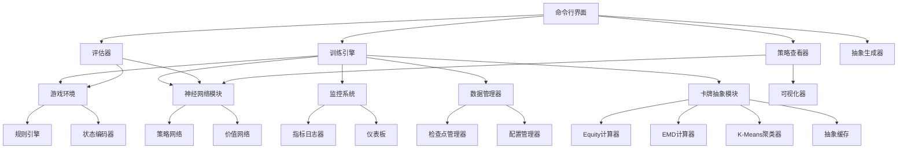

# 设计文档

## 概述

本系统是一个完整的德州扑克单挑AI训练平台，采用深度强化学习技术训练能够在单挑模式下做出最优决策的AI代理。系统核心采用Deep CFR（Counterfactual Regret Minimization）算法，结合神经网络逼近策略和价值函数。

系统主要由以下几个模块组成：
- **训练引擎**：执行自我对弈和策略更新
- **游戏环境**：模拟德州扑克规则和状态转换
- **神经网络模块**：策略网络和价值网络
- **监控系统**：实时跟踪训练指标
- **策略分析器**：可视化和分析训练好的策略
- **数据管理**：处理模型保存、加载和训练数据持久化
- **卡牌抽象模块**：实现Potential-Aware抽象，减少翻后阶段的状态空间

**核心创新：Potential-Aware抽象**

传统的Distribution-Aware抽象方法仅考虑手牌在最终轮（河牌）的强度分布。然而，两手牌可能在河牌阶段有相似的强度分布，但在中间轮次（转牌）实现强度的方式完全不同。例如：
- 手牌A：翻牌后有顶对，在转牌和河牌阶段强度稳定
- 手牌B：翻牌后有听牌，在转牌阶段可能变得很强或很弱

Potential-Aware抽象通过考虑手牌在所有未来轮次的强度分布轨迹，能够区分这两种情况，从而生成更高质量的抽象。

技术栈：
- Python 3.9+
- PyTorch（深度学习框架）
- NumPy（数值计算）
- SciPy（EMD计算优化）
- 属性测试库：Hypothesis

## 架构

### 系统架构图



### 模块职责

1. **训练引擎（TrainEngine）**
   - 协调整个训练流程
   - 管理自我对弈循环
   - 执行策略更新
   - 处理并行训练

2. **游戏环境（GameEnv）**
   - 模拟德州扑克游戏逻辑
   - 管理游戏状态转换
   - 验证行动合法性
   - 计算奖励

3. **神经网络模块（NeuralNet）**
   - 策略网络：输出行动概率分布
   - 价值网络：估计状态价值
   - 提供前向传播和反向传播接口

4. **监控系统（Monitor）**
   - 收集训练指标
   - 实时显示训练进度
   - 记录日志
   - 生成可视化图表

5. **策略分析器（StrategyViewer）**
   - 加载训练好的模型
   - 分析特定状态下的策略
   - 生成策略热图
   - 提供交互式查询界面

6. **卡牌抽象模块（CardAbstraction）**
   - 计算手牌的Equity分布
   - 实现Potential-Aware抽象算法
   - 使用EMD作为距离度量
   - 执行k-means聚类
   - 管理抽象结果的缓存和加载

## 组件和接口

### 游戏环境组件

#### GameState（游戏状态）
```python
class GameState:
    """表示德州扑克游戏的完整状态"""
    player_hands: List[Tuple[Card, Card]]  # 玩家手牌
    community_cards: List[Card]  # 公共牌
    pot: int  # 底池
    player_stacks: List[int]  # 玩家筹码
    current_bets: List[int]  # 当前下注
    button_position: int  # 庄家位置
    stage: GameStage  # 游戏阶段（翻牌前/翻牌/转牌/河牌）
    action_history: List[Action]  # 行动历史
```

#### PokerEnvironment（扑克环境）
```python
class PokerEnvironment:
    """德州扑克游戏环境"""
    
    def reset() -> GameState:
        """开始新的一手牌，返回初始状态"""
        
    def step(action: Action) -> Tuple[GameState, float, bool]:
        """执行行动，返回新状态、奖励和是否结束"""
        
    def get_legal_actions(state: GameState) -> List[Action]:
        """获取当前状态下的合法行动"""
        
    def evaluate_hand(cards: List[Card]) -> HandRank:
        """评估手牌强度"""
```

#### RuleEngine（规则引擎）
```python
class RuleEngine:
    """德州扑克规则验证和执行"""
    
    def is_action_legal(state: GameState, action: Action) -> bool:
        """验证行动是否合法"""
        
    def apply_action(state: GameState, action: Action) -> GameState:
        """应用行动并返回新状态"""
        
    def determine_winner(state: GameState) -> int:
        """判定胜者并返回玩家索引"""
        
    def compare_hands(hand1: List[Card], hand2: List[Card], 
                     community: List[Card]) -> int:
        """比较两手牌的大小"""
```

### 神经网络组件

#### StateEncoder（状态编码器）
```python
class StateEncoder:
    """将游戏状态编码为神经网络输入"""
    
    def encode(state: GameState, player_id: int) -> np.ndarray:
        """编码状态为特征向量"""
        
    def encode_cards(cards: List[Card]) -> np.ndarray:
        """编码牌为one-hot向量"""
        
    def encode_betting_history(history: List[Action]) -> np.ndarray:
        """编码下注历史"""
```

#### PolicyNetwork（策略网络）
```python
class PolicyNetwork(nn.Module):
    """策略网络：输出行动概率分布"""
    
    def __init__(self, input_dim: int, hidden_dims: List[int], 
                 action_dim: int):
        """初始化网络架构"""
        
    def forward(state_encoding: torch.Tensor) -> torch.Tensor:
        """前向传播，返回行动logits"""
        
    def get_action_probs(state_encoding: torch.Tensor) -> torch.Tensor:
        """获取行动概率分布"""
```

#### ValueNetwork（价值网络）
```python
class ValueNetwork(nn.Module):
    """价值网络：估计状态价值"""
    
    def __init__(self, input_dim: int, hidden_dims: List[int]):
        """初始化网络架构"""
        
    def forward(state_encoding: torch.Tensor) -> torch.Tensor:
        """前向传播，返回状态价值估计"""
```

### 训练组件

#### TrainingEngine（训练引擎）
```python
class TrainingEngine:
    """管理训练流程"""
    
    def __init__(self, config: TrainingConfig):
        """初始化训练引擎"""
        
    def train(num_episodes: int) -> None:
        """执行训练循环"""
        
    def self_play_episode() -> Episode:
        """执行一次自我对弈回合"""
        
    def update_policy(episodes: List[Episode]) -> Dict[str, float]:
        """更新策略网络，返回训练指标"""
        
    def save_checkpoint(path: str) -> None:
        """保存训练检查点"""
        
    def load_checkpoint(path: str) -> None:
        """加载训练检查点"""
```

#### CFRTrainer（CFR训练器）
```python
class CFRTrainer:
    """实现CFR算法的训练器"""
    
    def compute_regrets(episode: Episode) -> Dict[InfoSet, np.ndarray]:
        """计算反事实遗憾值"""
        
    def update_strategy(regrets: Dict[InfoSet, np.ndarray]) -> None:
        """基于遗憾值更新策略"""
        
    def get_average_strategy() -> Dict[InfoSet, np.ndarray]:
        """获取平均策略"""
    
    def get_cfr_guided_target(info_set: InfoSet, legal_actions: List[Action]) -> np.ndarray:
        """获取CFR引导的目标策略分布，用于神经网络训练"""
```

### 训练优化组件

#### 熵正则化（Entropy Regularization）

熵正则化用于防止策略过早收敛到确定性策略，确保所有行动都保持一定的探索概率。

```python
def compute_entropy_loss(action_probs: torch.Tensor) -> torch.Tensor:
    """计算策略熵损失
    
    熵 H(π) = -Σ π(a) * log(π(a))
    熵越大表示策略越均匀，熵越小表示策略越确定
    
    Args:
        action_probs: 行动概率分布 [batch_size, num_actions]
        
    Returns:
        负熵值（用于最小化，即最大化熵）
    """
```

#### CFR-神经网络集成

CFR训练器与神经网络的集成方式：

1. **CFR引导训练**：使用CFR计算的平均策略作为神经网络的训练目标
2. **遗憾值传播**：将CFR的遗憾值信息用于指导神经网络的梯度更新
3. **策略混合**：在行动选择时混合神经网络策略和CFR策略

```python
class TrainingEngine:
    def update_policy_with_cfr(self, episodes: List[Episode]) -> Dict[str, float]:
        """使用CFR引导的策略更新
        
        1. 计算每个状态的CFR目标策略
        2. 使用KL散度损失让神经网络逼近CFR策略
        3. 添加熵正则化防止策略坍塌
        """
```

### 监控组件

#### MetricsCollector（指标收集器）
```python
class MetricsCollector:
    """收集和聚合训练指标"""
    
    def record_episode(episode: Episode) -> None:
        """记录回合数据"""
        
    def get_current_metrics() -> Dict[str, float]:
        """获取当前指标"""
        
    def get_metric_history(metric_name: str) -> List[float]:
        """获取指标历史"""
```

#### TrainingMonitor（训练监控器）
```python
class TrainingMonitor:
    """实时监控训练进度"""
    
    def start() -> None:
        """启动监控"""
        
    def update(metrics: Dict[str, float]) -> None:
        """更新显示的指标"""
        
    def plot_metrics(metric_names: List[str]) -> None:
        """绘制指标曲线"""
        
    def check_anomalies(metrics: Dict[str, float]) -> List[str]:
        """检查异常情况"""
```

### 策略分析组件

#### StrategyAnalyzer（策略分析器）
```python
class StrategyAnalyzer:
    """分析训练好的策略"""
    
    def load_model(checkpoint_path: str) -> None:
        """加载模型"""
        
    def analyze_state(state: GameState) -> Dict[Action, float]:
        """分析特定状态下的行动概率"""
        
    def generate_strategy_heatmap(hand_range: List[Tuple[Card, Card]]) 
        -> np.ndarray:
        """生成策略热图"""
        
    def explain_decision(state: GameState, action: Action) -> str:
        """解释决策理由"""
```

### 数据管理组件

#### CheckpointManager（检查点管理器）
```python
class CheckpointManager:
    """管理模型检查点"""
    
    def save(model: nn.Module, optimizer: Optimizer, 
             metadata: Dict) -> str:
        """保存检查点，返回文件路径"""
        
    def load(checkpoint_path: str) -> Tuple[nn.Module, Optimizer, Dict]:
        """加载检查点"""
        
    def list_checkpoints() -> List[CheckpointInfo]:
        """列出所有可用检查点"""
        
    def delete(checkpoint_path: str) -> None:
        """删除检查点"""
```

#### ConfigManager（配置管理器）
```python
class ConfigManager:
    """管理训练配置"""
    
    def load_config(path: str) -> TrainingConfig:
        """从文件加载配置"""
        
    def save_config(config: TrainingConfig, path: str) -> None:
        """保存配置到文件"""
        
    def validate_config(config: TrainingConfig) -> List[str]:
        """验证配置，返回错误列表"""
```

### 卡牌抽象组件

#### EquityCalculator（Equity计算器）
```python
class EquityCalculator:
    """计算手牌的Equity（胜率）分布"""
    
    def calculate_equity(hole_cards: Tuple[Card, Card], 
                        community_cards: List[Card]) -> float:
        """计算手牌对抗随机对手的Equity
        
        Args:
            hole_cards: 玩家的两张手牌
            community_cards: 当前的公共牌（0-5张）
            
        Returns:
            Equity值（0-1之间的浮点数）
        """
        
    def calculate_equity_distribution(hole_cards: Tuple[Card, Card],
                                      community_cards: List[Card],
                                      num_bins: int = 50) -> np.ndarray:
        """计算手牌在所有可能公共牌面下的Equity分布直方图
        
        Args:
            hole_cards: 玩家的两张手牌
            community_cards: 当前的公共牌
            num_bins: 直方图的区间数量（默认50，每个区间宽度0.02）
            
        Returns:
            直方图数组，表示落入每个Equity区间的概率
        """
        
    def calculate_turn_bucket_distribution(hole_cards: Tuple[Card, Card],
                                           flop_cards: List[Card],
                                           turn_abstraction: 'CardAbstraction'
                                           ) -> np.ndarray:
        """计算翻牌手牌在转牌阶段各个桶的分布（用于Potential-Aware抽象）
        
        Args:
            hole_cards: 玩家的两张手牌
            flop_cards: 翻牌的3张公共牌
            turn_abstraction: 转牌阶段的抽象映射
            
        Returns:
            直方图数组，表示落入每个转牌桶的概率
        """
```

#### EMDCalculator（Earth Mover's Distance计算器）
```python
class EMDCalculator:
    """计算两个分布之间的Earth Mover's Distance"""
    
    def calculate_emd_1d(hist1: np.ndarray, hist2: np.ndarray) -> float:
        """计算两个一维直方图之间的EMD
        
        使用线性时间算法：扫描直方图并累计需要移动的"土"的距离
        
        Args:
            hist1: 第一个直方图（归一化后的概率分布）
            hist2: 第二个直方图（归一化后的概率分布）
            
        Returns:
            EMD距离值
        """
        
    def calculate_emd_with_ground_distance(hist1: np.ndarray, 
                                           hist2: np.ndarray,
                                           ground_distances: np.ndarray
                                           ) -> float:
        """计算两个直方图之间的EMD，使用自定义的地面距离矩阵
        
        用于Potential-Aware抽象，其中地面距离是下一轮次桶之间的EMD
        
        Args:
            hist1: 第一个直方图（在下一轮次桶上的分布）
            hist2: 第二个直方图
            ground_distances: 桶之间的地面距离矩阵
            
        Returns:
            EMD距离值
        """
        
    def calculate_emd_fast_approximation(point: np.ndarray,
                                         mean: np.ndarray,
                                         sorted_distances: np.ndarray,
                                         ordered_clusters: np.ndarray
                                         ) -> float:
        """快速近似EMD计算（用于大规模k-means聚类）
        
        利用稀疏性和预计算的排序距离来加速计算
        
        Args:
            point: 数据点的直方图表示
            mean: 聚类中心的直方图表示
            sorted_distances: 预计算的排序距离数组
            ordered_clusters: 按距离排序的聚类索引
            
        Returns:
            近似的EMD距离值
        """
```

#### CardAbstraction（卡牌抽象）
```python
@dataclass
class AbstractionConfig:
    """抽象配置"""
    preflop_buckets: int = 169  # 翻牌前桶数（169=无抽象）
    flop_buckets: int = 5000    # 翻牌桶数
    turn_buckets: int = 5000    # 转牌桶数
    river_buckets: int = 5000   # 河牌桶数
    equity_bins: int = 50       # Equity直方图区间数
    kmeans_restarts: int = 25   # k-means重启次数
    use_potential_aware: bool = True  # 是否使用Potential-Aware抽象
    random_seed: int = 42       # 随机种子（用于可重复性）


class CardAbstraction:
    """卡牌抽象管理器"""
    
    def __init__(self, config: AbstractionConfig):
        """初始化抽象管理器"""
        
    def generate_abstraction(self) -> None:
        """生成完整的卡牌抽象
        
        算法流程（从后向前）：
        1. 河牌阶段：使用Equity分布 + EMD + k-means
        2. 转牌阶段：使用河牌桶分布 + EMD + k-means
        3. 翻牌阶段（Potential-Aware）：
           - 计算每个翻牌手牌在转牌桶上的分布
           - 使用转牌桶之间的EMD作为地面距离
           - 执行k-means聚类
        4. 翻牌前：无抽象（169个独立桶）
        """
        
    def get_bucket_id(self, hole_cards: Tuple[Card, Card],
                      community_cards: List[Card]) -> int:
        """获取手牌组合对应的桶ID
        
        Args:
            hole_cards: 玩家的两张手牌
            community_cards: 当前的公共牌
            
        Returns:
            桶ID（整数）
        """
        
    def save(self, path: str) -> None:
        """保存抽象结果到文件
        
        保存内容包括：
        - 抽象配置
        - 每个阶段的桶映射表
        - 聚类中心（用于调试和分析）
        """
        
    def load(self, path: str) -> None:
        """从文件加载抽象结果"""
        
    def get_abstraction_stats(self) -> Dict[str, Any]:
        """获取抽象统计信息
        
        Returns:
            包含以下信息的字典：
            - 每个阶段的桶数量
            - 每个阶段的平均桶大小
            - 每个阶段的最大桶大小
            - WCSS（Within-Cluster Sum of Squares）
        """


class PotentialAwareAbstractor:
    """Potential-Aware抽象算法实现"""
    
    def __init__(self, equity_calculator: EquityCalculator,
                 emd_calculator: EMDCalculator,
                 config: AbstractionConfig):
        """初始化抽象器"""
        
    def compute_river_abstraction(self) -> Tuple[np.ndarray, np.ndarray]:
        """计算河牌阶段的抽象
        
        Returns:
            (bucket_mapping, cluster_centers)
            - bucket_mapping: 手牌组合到桶ID的映射
            - cluster_centers: 聚类中心（Equity直方图）
        """
        
    def compute_turn_abstraction(self, 
                                 river_abstraction: np.ndarray
                                 ) -> Tuple[np.ndarray, np.ndarray]:
        """计算转牌阶段的抽象
        
        Args:
            river_abstraction: 河牌阶段的抽象映射
            
        Returns:
            (bucket_mapping, cluster_centers)
        """
        
    def compute_flop_abstraction(self,
                                 turn_abstraction: np.ndarray,
                                 turn_centers: np.ndarray
                                 ) -> Tuple[np.ndarray, np.ndarray]:
        """计算翻牌阶段的Potential-Aware抽象
        
        这是核心算法：
        1. 对每个翻牌手牌，计算其在转牌桶上的分布直方图
        2. 计算转牌桶之间的EMD作为地面距离
        3. 使用EMD（带地面距离）作为距离度量执行k-means
        
        Args:
            turn_abstraction: 转牌阶段的抽象映射
            turn_centers: 转牌阶段的聚类中心
            
        Returns:
            (bucket_mapping, cluster_centers)
        """
        
    def _kmeans_with_emd(self, 
                         histograms: np.ndarray,
                         num_clusters: int,
                         ground_distances: Optional[np.ndarray] = None
                         ) -> Tuple[np.ndarray, np.ndarray, float]:
        """使用EMD作为距离度量的k-means聚类
        
        Args:
            histograms: 所有数据点的直方图表示
            num_clusters: 目标聚类数量
            ground_distances: 可选的地面距离矩阵
            
        Returns:
            (labels, centers, wcss)
            - labels: 每个数据点的聚类标签
            - centers: 聚类中心
            - wcss: Within-Cluster Sum of Squares
        """
```

#### AbstractionCache（抽象缓存）
```python
class AbstractionCache:
    """管理抽象结果的缓存和快速查询"""
    
    def __init__(self, abstraction: CardAbstraction):
        """初始化缓存
        
        将抽象映射加载到内存中，支持O(1)查询
        """
        
    def get_bucket(self, hole_cards: Tuple[Card, Card],
                   community_cards: List[Card]) -> int:
        """快速查询桶ID
        
        使用预计算的查找表，时间复杂度O(1)
        """
        
    def get_canonical_hand(self, hole_cards: Tuple[Card, Card]) -> int:
        """获取手牌的规范化表示
        
        将手牌转换为规范化索引，用于查找表
        考虑花色同构性（如AhKh和AsKs是等价的）
        """
```

## 数据模型

### Card（扑克牌）
```python
@dataclass
class Card:
    rank: int  # 2-14 (2-10, J=11, Q=12, K=13, A=14)
    suit: str  # 'h', 'd', 'c', 's' (红心、方块、梅花、黑桃)
```

### Action（行动）
```python
@dataclass
class Action:
    action_type: ActionType  # FOLD, CHECK, CALL, RAISE
    amount: int  # 加注金额（仅用于RAISE）
```

### Episode（训练回合）
```python
@dataclass
class Episode:
    states: List[GameState]  # 状态序列
    actions: List[Action]  # 行动序列
    rewards: List[float]  # 奖励序列
    player_id: int  # 玩家ID
    final_reward: float  # 最终奖励
```

### TrainingConfig（训练配置）
```python
@dataclass
class TrainingConfig:
    learning_rate: float  # 学习率
    batch_size: int  # 批次大小
    num_episodes: int  # 训练回合数
    discount_factor: float  # 折扣因子
    network_architecture: List[int]  # 网络隐藏层维度
    checkpoint_interval: int  # 检查点保存间隔
    num_parallel_envs: int  # 并行环境数量
    initial_stack: int  # 初始筹码
    small_blind: int  # 小盲注
    big_blind: int  # 大盲注
    entropy_coefficient: float  # 熵正则化系数（默认0.01）
    cfr_weight: float  # CFR引导权重（默认0.5）
```

### CheckpointInfo（检查点信息）
```python
@dataclass
class CheckpointInfo:
    path: str  # 文件路径
    episode_number: int  # 训练回合数
    timestamp: datetime  # 保存时间
    win_rate: float  # 胜率
    avg_reward: float  # 平均奖励
```

### AbstractionConfig（抽象配置）
```python
@dataclass
class AbstractionConfig:
    preflop_buckets: int = 169  # 翻牌前桶数（169=无抽象）
    flop_buckets: int = 5000    # 翻牌桶数
    turn_buckets: int = 5000    # 转牌桶数
    river_buckets: int = 5000   # 河牌桶数
    equity_bins: int = 50       # Equity直方图区间数
    kmeans_restarts: int = 25   # k-means重启次数
    use_potential_aware: bool = True  # 是否使用Potential-Aware抽象
    random_seed: int = 42       # 随机种子
```

### EquityHistogram（Equity直方图）
```python
@dataclass
class EquityHistogram:
    bins: np.ndarray  # 直方图区间边界
    counts: np.ndarray  # 每个区间的计数/概率
    
    def normalize(self) -> 'EquityHistogram':
        """归一化直方图，使概率和为1"""
        
    def to_sparse(self) -> Tuple[np.ndarray, np.ndarray]:
        """转换为稀疏表示（非零索引和值）"""
```

### AbstractionResult（抽象结果）
```python
@dataclass
class AbstractionResult:
    config: AbstractionConfig  # 抽象配置
    preflop_mapping: np.ndarray  # 翻牌前映射
    flop_mapping: np.ndarray  # 翻牌映射
    turn_mapping: np.ndarray  # 转牌映射
    river_mapping: np.ndarray  # 河牌映射
    flop_centers: np.ndarray  # 翻牌聚类中心
    turn_centers: np.ndarray  # 转牌聚类中心
    river_centers: np.ndarray  # 河牌聚类中心
    wcss: Dict[str, float]  # 每个阶段的WCSS
    generation_time: float  # 生成耗时（秒）
```


## 正确性属性

*属性是指在系统的所有有效执行中都应该成立的特征或行为——本质上是关于系统应该做什么的形式化陈述。属性是人类可读规范和机器可验证正确性保证之间的桥梁。*

### 属性 1：训练初始化完整性
*对于任何*有效的训练配置，启动训练会话应该成功初始化策略网络（参数非空）并开始执行训练循环
**验证需求：1.1**

### 属性 2：训练终止安全性
*对于任何*训练会话，无论是达到指定回合数还是手动停止，系统都应该保存最终模型状态且文件可被成功加载
**验证需求：1.5**

### 属性 3：检查点保存间隔一致性
*对于任何*指定的检查点间隔N，运行N个回合的训练应该至少创建一个检查点文件
**验证需求：1.3**

### 属性 4：配置参数应用正确性
*对于任何*有效的训练配置参数（学习率、批次大小等），启动训练后，训练器内部使用的参数应该与配置中指定的参数相匹配
**验证需求：1.4**

### 属性 5：游戏初始化规则符合性
*对于任何*新开始的游戏回合，每个玩家应该恰好收到2张手牌，且盲注应该被正确设置
**验证需求：2.1**

### 属性 6：行动合法性验证
*对于任何*游戏状态和行动，如果行动不在合法行动列表中，系统应该拒绝该行动；如果行动合法，系统应该成功更新游戏状态
**验证需求：2.2**

### 属性 7：胜负判定正确性
*对于任何*对局结束状态，胜者应该获得底池中的所有筹码，且两个玩家的筹码总和应该保持不变（守恒性）
**验证需求：2.3**

### 属性 8：游戏阶段转换正确性
*对于任何*游戏进程，翻牌阶段应该发放3张公共牌，转牌阶段应该发放1张公共牌，河牌阶段应该发放1张公共牌，总共5张公共牌
**验证需求：2.4**

### 属性 9：监控指标更新频率
*对于任何*运行中的训练会话，在指定的时间间隔T内，监控系统应该至少更新一次训练指标
**验证需求：3.1**

### 属性 10：监控指标完整性
*对于任何*训练指标查询请求，返回的数据应该包含胜率、平均奖励、损失值和已完成回合数这四个字段
**验证需求：3.2**

### 属性 11：指标持久化一致性
*对于任何*训练指标更新，日志文件中应该包含对应的记录，且记录的数据与内存中的指标一致
**验证需求：3.3**

### 属性 12：模型加载成功性
*对于任何*已保存的模型检查点，策略查看器应该能够成功加载模型参数而不出现错误
**验证需求：4.1**

### 属性 13：策略概率分布有效性
*对于任何*游戏状态，策略查看器返回的行动概率分布应该满足：所有概率非负，且概率之和等于1（误差在1e-6内）
**验证需求：4.2**

### 属性 14：策略热图数据完整性
*对于任何*手牌范围请求，生成的策略热图数据应该覆盖所有请求的手牌组合，且每个组合都有对应的行动概率
**验证需求：4.3**

### 属性 15：决策解释完整性
*对于任何*游戏状态和行动查询，返回的决策解释应该包含期望价值计算结果
**验证需求：4.4**

### 属性 16：多模型比较数据完整性
*对于任何*多模型比较请求，返回的数据应该包含所有指定模型在相同状态下的策略信息
**验证需求：4.5**

### 属性 17：检查点往返一致性
*对于任何*模型状态和优化器状态，保存为检查点后再加载，应该恢复出等价的模型参数和优化器状态
**验证需求：5.1, 5.2**

### 属性 18：检查点列表完整性
*对于任何*已保存的检查点集合，列出检查点应该返回所有检查点的信息，且每个检查点信息包含路径、回合数、时间戳和性能指标
**验证需求：5.3**

### 属性 19：检查点删除有效性
*对于任何*存在的检查点文件，删除操作后，该文件应该不再存在于文件系统中，且不再出现在检查点列表中
**验证需求：5.4**

### 属性 20：检查点文件名唯一性
*对于任何*训练会话，连续保存多个检查点应该生成不同的文件名，不会发生覆盖
**验证需求：5.5**

### 属性 21：评估对局数量正确性
*对于任何*指定的评估对局数N，评估会话应该恰好执行N局游戏
**验证需求：6.1**

### 属性 22：评估指标计算正确性
*对于任何*评估会话，返回的胜率应该等于（胜局数 / 总局数），且报告应该包含平均盈利和标准差
**验证需求：6.2**

### 属性 23：基准策略应用正确性
*对于任何*指定的基准策略，评估会话中的对手应该使用该策略做出决策
**验证需求：6.3**

### 属性 24：多模型评估报告完整性
*对于任何*多模型评估请求，生成的报告应该包含所有指定模型的性能数据
**验证需求：6.4**

### 属性 25：评估结果持久化正确性
*对于任何*评估会话，结果应该被保存到文件中，且文件内容包含所有评估指标
**验证需求：6.5**

### 属性 26：配置验证正确性
*对于任何*训练配置，如果所有必需参数都存在且有效，系统应该接受配置；如果任何必需参数缺失或无效，系统应该拒绝配置
**验证需求：7.1**

### 属性 27：配置错误信息清晰性
*对于任何*无效的配置参数，系统返回的错误信息应该明确指出哪个参数无效以及原因
**验证需求：7.2**

### 属性 28：配置往返一致性
*对于任何*训练配置对象，保存为JSON文件后再加载，应该恢复出等价的配置对象
**验证需求：7.3, 7.4**

### 属性 29：配置默认值应用正确性
*对于任何*缺少可选参数的配置文件，加载后的配置对象应该包含所有可选参数的默认值
**验证需求：7.5**

### 属性 30：并行环境创建正确性
*对于任何*指定的工作进程数N，启用并行训练应该创建恰好N个并行游戏环境
**验证需求：8.1, 8.4**

### 属性 31：并行数据聚合完整性
*对于任何*并行训练会话，收集到的训练数据总量应该等于所有工作进程生成的数据量之和
**验证需求：8.2**

### 属性 32：训练日志记录完整性
*对于任何*完成的训练回合，训练日志应该包含该回合的状态、行动和奖励数据
**验证需求：9.1**

### 属性 33：训练数据往返一致性
*对于任何*写入训练日志的数据，从持久化存储中读取应该返回相同的数据
**验证需求：9.2**

### 属性 34：训练指标索引正确性
*对于任何*存储的训练指标，数据记录应该包含时间戳和回合编号字段
**验证需求：9.3**

### 属性 35：数据导出格式正确性
*对于任何*训练数据导出请求，生成的文件应该是有效的CSV或JSON格式，且可以被标准解析器解析
**验证需求：9.5**

### 属性 36：命令行训练启动正确性
*对于任何*有效的训练命令行参数，系统应该成功解析参数并启动训练会话
**验证需求：10.1**

### 属性 37：命令行评估启动正确性
*对于任何*有效的评估命令行参数，系统应该加载指定的模型并启动评估会话
**验证需求：10.2**

### 属性 38：命令行策略查看启动正确性
*对于任何*有效的策略查看命令行参数，系统应该启动策略查看器功能
**验证需求：10.3**

### 属性 39：命令行错误处理正确性
*对于任何*无效或缺失的命令行参数，系统应该显示帮助信息而不是崩溃
**验证需求：10.4**

### 属性 40：命令行帮助信息完整性
*对于任何*帮助请求，系统返回的帮助信息应该列出所有可用命令及其说明
**验证需求：10.5**

### 属性 41：Potential-Aware抽象考虑未来轮次
*对于任何*翻牌阶段的手牌组合，Potential-Aware抽象计算的特征向量应该包含该手牌在转牌阶段各个桶的分布信息（而非仅包含河牌阶段的最终Equity分布）
**验证需求：11.1**

### 属性 42：EMD距离度量正确性
*对于任何*两个归一化的直方图，计算的EMD距离应该满足：非负性、对称性、三角不等式
**验证需求：11.2**

### 属性 43：k-means聚类桶数量正确性
*对于任何*指定的桶数量N，k-means聚类应该生成恰好N个非空的桶
**验证需求：11.3, 11.4**

### 属性 44：Imperfect Recall抽象允许信息遗忘
*对于任何*两个在翻牌前可区分的手牌组合，如果它们在翻牌阶段被归入同一个桶，系统应该在翻牌阶段将它们视为等价状态
**验证需求：11.5**

### 属性 45：抽象状态等价性
*对于任何*同一桶内的两个手牌组合，训练系统应该对它们使用相同的策略
**验证需求：11.6**

### 属性 46：Equity分布直方图归一化
*对于任何*手牌组合，计算的Equity分布直方图的概率和应该等于1（误差在1e-6内）
**验证需求：12.1, 12.2**

### 属性 47：Equity直方图区间覆盖完整性
*对于任何*指定的区间数量N，生成的Equity直方图应该恰好有N个区间，覆盖[0, 1]的完整范围
**验证需求：12.2**

### 属性 48：Potential-Aware特征维度正确性
*对于任何*翻牌阶段的手牌，其Potential-Aware特征向量的维度应该等于转牌阶段的桶数量
**验证需求：12.3**

### 属性 49：一维EMD线性时间计算
*对于任何*两个长度为N的一维直方图，EMD计算的时间复杂度应该为O(N)
**验证需求：13.1**

### 属性 50：EMD地面距离传递性
*对于任何*三个桶A、B、C，使用下一轮次EMD作为地面距离时，应该满足三角不等式：d(A,C) ≤ d(A,B) + d(B,C)
**验证需求：13.3**

### 属性 51：稀疏直方图EMD计算效率
*对于任何*稀疏直方图（非零元素数量为K），EMD计算的时间复杂度应该与K成正比（而非与直方图总长度成正比）
**验证需求：13.4**

### 属性 52：抽象结果持久化往返一致性
*对于任何*生成的抽象结果，保存到文件后再加载，应该恢复出等价的抽象映射
**验证需求：14.1, 14.2**

### 属性 53：桶ID查询O(1)时间复杂度
*对于任何*手牌组合和公共牌组合，查询对应的桶ID应该在常数时间内完成
**验证需求：14.3**

### 属性 54：抽象配置变化检测
*对于任何*抽象配置参数的改变，系统应该能够检测到配置与已缓存抽象不匹配
**验证需求：14.4**

### 属性 55：抽象元数据完整性
*对于任何*保存的抽象结果，文件应该包含完整的配置元数据（桶数量、距离度量类型、随机种子等）
**验证需求：14.5**

### 属性 56：WCSS质量指标计算正确性
*对于任何*k-means聚类结果，计算的WCSS应该等于所有数据点到其聚类中心距离平方和
**验证需求：15.1**

### 属性 57：桶大小分布统计完整性
*对于任何*抽象结果，统计报告应该包含每个阶段的桶数量、平均桶大小和最大桶大小
**验证需求：15.2, 15.4**

### 属性 58：抽象可重复性
*对于任何*相同的抽象配置（包括随机种子），多次运行应该生成完全相同的抽象结果
**验证需求：15.3**

## 错误处理

### 错误类型

1. **配置错误**
   - 无效的参数值（如负数学习率）
   - 缺失必需参数
   - 不兼容的参数组合
   - 处理：验证配置并返回详细错误信息，拒绝启动训练

2. **运行时错误**
   - 内存不足
   - 磁盘空间不足
   - GPU不可用（如果配置要求GPU）
   - 处理：捕获异常，保存当前状态，优雅终止并通知用户

3. **数据错误**
   - 检查点文件损坏
   - 配置文件格式错误
   - 日志文件写入失败
   - 处理：尝试恢复或使用备份，无法恢复时报告错误

4. **游戏逻辑错误**
   - 非法行动尝试
   - 状态不一致
   - 处理：记录错误状态，拒绝非法操作，必要时重置游戏

5. **并行训练错误**
   - 工作进程崩溃
   - 进程间通信失败
   - 处理：检测失败进程，清理资源，可选择重启或终止训练

### 错误恢复策略

1. **检查点恢复**：训练中断时，可以从最近的检查点恢复
2. **自动重试**：对于临时性错误（如网络IO），自动重试有限次数
3. **降级运行**：GPU不可用时自动切换到CPU训练
4. **数据验证**：加载检查点前验证文件完整性

### 日志记录

- 所有错误都应该记录到日志文件
- 包含时间戳、错误类型、堆栈跟踪
- 区分不同严重级别：DEBUG、INFO、WARNING、ERROR、CRITICAL

## 测试策略

### 双重测试方法

本系统采用单元测试和基于属性的测试相结合的方法，以确保全面的正确性验证：

- **单元测试**：验证特定示例、边缘情况和错误条件
- **基于属性的测试**：验证应该在所有输入上成立的通用属性
- 两者互补：单元测试捕获具体的bug，基于属性的测试验证通用正确性

### 单元测试

单元测试覆盖以下方面：

1. **游戏规则验证**
   - 特定手牌组合的牌型识别（如测试"A♠ K♠ Q♠ J♠ 10♠"被识别为同花顺）
   - 特定场景下的胜负判定
   - 边缘情况：平局、全下、盲注对局

2. **组件集成**
   - 训练引擎与游戏环境的交互
   - 神经网络的前向传播和反向传播
   - 监控系统与训练引擎的数据流

3. **错误条件**
   - 无效配置的拒绝
   - 文件不存在时的错误处理
   - 磁盘空间不足的处理

### 基于属性的测试

**测试库**：使用Hypothesis进行基于属性的测试

**配置要求**：
- 每个基于属性的测试应该运行至少100次迭代
- 每个测试必须用注释明确引用设计文档中的正确性属性
- 注释格式：`# Feature: texas-holdem-ai-training, Property {编号}: {属性文本}`

**测试实现要求**：
- 每个正确性属性必须由一个基于属性的测试实现
- 测试应该尽可能避免使用mock，以验证真实功能
- 使用智能生成器来约束输入空间

**属性测试覆盖**：

1. **训练流程属性**（属性1-4）
   - 生成随机训练配置，验证初始化和终止行为
   - 验证检查点保存间隔
   - 验证配置参数正确应用

2. **游戏环境属性**（属性5-8）
   - 生成随机游戏状态，验证规则符合性
   - 验证行动合法性检查
   - 验证筹码守恒性
   - 验证游戏阶段转换

3. **监控系统属性**（属性9-11）
   - 验证指标更新频率和完整性
   - 验证数据持久化一致性

4. **策略分���属性**（属性12-16）
   - 验证模型加载
   - 验证概率分布有效性
   - 验证数据完整性

5. **模型管理属性**（属性17-20）
   - 验证检查点往返一致性
   - 验证文件操作正确性

6. **评估系统属性**（属性21-25）
   - 验证评估流程正确性
   - 验证指标计算
   - 验证结果持久化

7. **配置管理属性**（属性26-29）
   - 验证配置验证逻辑
   - 验证配置往返一致性
   - 验证默认值应用

8. **并行训练属性**（属性30-31）
   - 验证并行环境创建
   - 验证数据聚合

9. **数据持久化属性**（属性32-35）
   - 验证日志记录
   - 验证数据往返一致性
   - 验证导出格式

10. **命令行接口属性**（属性36-40）
    - 验证命令解析
    - 验证错误处理
    - 验证帮助信息

11. **卡牌抽象属性**（属性41-58）
    - 验证Potential-Aware抽象考虑未来轮次
    - 验证EMD距离度量的数学性质
    - 验证k-means聚类正确性
    - 验证抽象结果持久化
    - 验证查询效率
    - 验证抽象质量指标

### 边缘情况测试

以下边缘情况需要专门的单元测试：

1. **手牌识别边缘情况**（需求2.5）
   - 所有9种牌型的典型示例
   - 边界情况：最小顺子（A-2-3-4-5）、最大顺子（10-J-Q-K-A）
   - 同花顺vs普通顺子
   - 使用公共牌的最佳组合

2. **异常情况**
   - 训练异常检测（需求3.5）：损失值发散
   - 并行训练进程错误（需求8.5）：模拟进程崩溃
   - 磁盘空间不足（需求9.4）：模拟IO错误

### 测试数据生成

使用Hypothesis的策略生成测试数据：

```python
# 扑克牌生成器
@st.composite
def card_strategy(draw):
    rank = draw(st.integers(min_value=2, max_value=14))
    suit = draw(st.sampled_from(['h', 'd', 'c', 's']))
    return Card(rank, suit)

# 游戏状态生成器
@st.composite
def game_state_strategy(draw):
    # 生成有效的游戏状态
    # 确保手牌和公共牌不重复
    # 确保筹码和下注金额合理
    ...

# 训练配置生成器
@st.composite
def training_config_strategy(draw):
    learning_rate = draw(st.floats(min_value=1e-5, max_value=1e-1))
    batch_size = draw(st.integers(min_value=1, max_value=256))
    ...
```

### 性能测试

虽然不是主要关注点，但应该包含基本的性能测试：

1. **训练速度**：测量每秒处理的游戏回合数
2. **内存使用**：监控训练过程中的内存占用
3. **并行效率**：测量并行训练的加速比

### 集成测试

端到端测试验证完整的工作流：

1. **完整训练流程**：从配置创建到模型训练到评估
2. **检查点恢复**：中断训练后从检查点恢复
3. **策略分析流程**：训练模型后进行策略分析

## 实现注意事项

### 状态编码设计

游戏状态需要编码为固定长度的向量，建议的编码方案：

1. **手牌编码**（104维）：每张牌用52维one-hot编码（13个等级 × 4个花色）
2. **公共牌编码**（260维）：5张公共牌，每张52维
3. **筹码信息**（4维）：自己筹码、对手筹码、底池、当前下注（归一化）
4. **位置信息**（2维）：是否在按钮位置、当前行动玩家
5. **下注历史**（可变长度，使用LSTM或注意力机制处理）

总输入维度：约370维（不含下注历史）

### 神经网络架构建议

**策略网络**：
- 输入层：370维
- 隐藏层：[512, 256, 128]
- 输出层：行动空间维度（弃牌、跟注、加注×N个金额档位）
- 激活函数：ReLU（隐藏层）、Softmax（输出层）

**价值网络**：
- 输入层：370维
- 隐藏层：[512, 256, 128]
- 输出层：1维（状态价值）
- 激活函数：ReLU（隐藏层）、Tanh（输出层）

### CFR算法实现要点

1. **信息集抽象**：将相似的游戏状态归为同一信息集以减少状态空间
2. **遗憾匹配**：使用Regret Matching算法更新策略
3. **平均策略**：训练过程中累积平均策略作为最终策略
4. **采样**：使用Monte Carlo CFR减少计算量

### 并行训练架构

使用多进程架构：
- 主进程：管理策略网络，执行参数更新
- 工作进程：运行游戏模拟，生成训练数据
- 通信：使用共享内存或消息队列传递经验数据

### 数据存储格式

1. **检查点文件**：使用PyTorch的`.pt`格式
2. **配置文件**：JSON格式
3. **训练日志**：JSON Lines格式（每行一个JSON对象）
4. **评估结果**：JSON格式

### 可扩展性考虑

1. **支持不同的RL算法**：设计抽象接口，便于切换算法（CFR、PPO、DQN等）
2. **支持不同的游戏变体**：模块化游戏规则，便于扩展到其他扑克变体
3. **支持自定义奖励函数**：允许用户定义奖励计算逻辑
4. **支持对手建模**：为未来添加对手建模功能预留接口

### Potential-Aware抽象实现要点

#### 算法流程

Potential-Aware抽象采用从后向前的计算顺序：

```
河牌阶段 → 转牌阶段 → 翻牌阶段 → 翻牌前
```

1. **河牌阶段抽象**
   - 对每个河牌手牌组合，计算其Equity值
   - 使用k-means聚类，以Equity差异作为距离度量
   - 生成river_buckets个桶

2. **转牌阶段抽象**
   - 对每个转牌手牌组合，计算其在河牌阶段的Equity分布直方图
   - 使用k-means聚类，以EMD作为距离度量
   - 生成turn_buckets个桶

3. **翻牌阶段抽象（Potential-Aware核心）**
   - 对每个翻牌手牌组合，计算其在转牌桶上的分布直方图
   - 计算转牌桶之间的EMD作为地面距离
   - 使用k-means聚类，以带地面距离的EMD作为距离度量
   - 生成flop_buckets个桶

4. **翻牌前**
   - 不进行抽象，保留169个独立桶（对应169种起手牌类型）

#### EMD计算优化

一维EMD的线性时间算法：

```python
def calculate_emd_1d(hist1: np.ndarray, hist2: np.ndarray) -> float:
    """O(N)时间复杂度的一维EMD计算"""
    emd = 0.0
    cumulative_diff = 0.0
    for i in range(len(hist1)):
        cumulative_diff += hist1[i] - hist2[i]
        emd += abs(cumulative_diff)
    return emd
```

多维EMD的快速近似算法（用于Potential-Aware抽象）：

```python
def calculate_emd_fast_approximation(point, mean, sorted_distances, ordered_clusters):
    """
    利用稀疏性的快速EMD近似
    
    关键优化：
    1. 只处理非零元素
    2. 使用预计算的排序距离
    3. 贪心地将质量从最近的桶移动
    """
    # 详见论文Algorithm 2
```

#### 手牌枚举与规范化

德州扑克的手牌组合数量：
- 翻牌前：169种（考虑花色同构性）
- 翻牌：约130万种（2张手牌 × 3张公共牌）
- 转牌：约5500万种
- 河牌：约250万种（最终状态）

花色同构性处理：
- AhKh 和 AsKs 是等价的（同花）
- AhKs 和 AsKh 是等价的（异花）
- 使用规范化函数将等价手牌映射到同一索引

#### 内存优化

由于手牌组合数量巨大，需要注意内存使用：

1. **稀疏表示**：直方图通常是稀疏的，使用稀疏矩阵存储
2. **分批处理**：翻牌阶段的130万个手牌分批计算
3. **内存映射**：大型映射表使用numpy的memmap
4. **增量计算**：k-means迭代时增量更新聚类中心

#### 并行化策略

抽象计算可以高度并行化：

1. **Equity计算并行化**：每个手牌组合的Equity计算相互独立
2. **直方图计算并行化**：每个手牌的直方图计算相互独立
3. **k-means并行化**：
   - 分配步骤：每个数据点独立计算到各中心的距离
   - 更新步骤：每个聚类的中心更新相互独立

#### 抽象文件格式

```json
{
    "config": {
        "preflop_buckets": 169,
        "flop_buckets": 5000,
        "turn_buckets": 5000,
        "river_buckets": 5000,
        "equity_bins": 50,
        "use_potential_aware": true,
        "random_seed": 42
    },
    "metadata": {
        "generation_time": 3600.5,
        "wcss": {
            "flop": 1234.5,
            "turn": 2345.6,
            "river": 3456.7
        }
    },
    "mappings": {
        "preflop": "preflop_mapping.npy",
        "flop": "flop_mapping.npy",
        "turn": "turn_mapping.npy",
        "river": "river_mapping.npy"
    },
    "centers": {
        "flop": "flop_centers.npy",
        "turn": "turn_centers.npy",
        "river": "river_centers.npy"
    }
}
```

#### 与训练系统的集成

抽象模块与训练系统的集成方式：

1. **状态编码修改**：
   - 原始编码：手牌 + 公共牌的one-hot编码
   - 抽象编码：桶ID的one-hot编码（维度大幅减少）

2. **CFR信息集映射**：
   - 原始信息集：基于具体手牌和公共牌
   - 抽象信息集：基于桶ID

3. **策略共享**：
   - 同一桶内的所有手牌共享相同的策略
   - 大幅减少需要学习的策略数量
