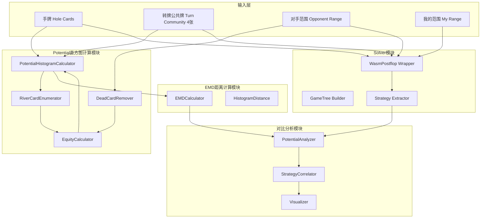

# 设计文档

## 概述

本实验设计一个验证框架，用于测试转牌阶段的Potential-Aware抽象方法。与河牌阶段使用简单的Equity标量不同，转牌阶段需要使用**Potential直方图**来表示手牌的强度分布。

根据论文"Potential-Aware Imperfect-Recall Abstraction with Earth Mover's Distance in Imperfect-Information Games"（AAAI 2014），核心思想是：

1. **Distribution-Aware抽象**：仅考虑当前轮次的Equity分布
2. **Potential-Aware抽象**：考虑手牌在所有未来轮次的强度分布轨迹

对于转牌阶段，Potential直方图捕获了手牌在河牌阶段的潜在强度分布。两个手牌即使当前Equity相似，如果它们在河牌阶段的分布不同（如一个是成牌，一个是听牌），也应该被分到不同的桶中。

## 架构



## 组件和接口

### 1. PotentialHistogramCalculator（Potential直方图计算器）

```python
class PotentialHistogramCalculator:
    """计算转牌阶段手牌的Potential直方图"""
    
    def __init__(self, num_bins: int = 50, num_workers: int = 0):
        """
        初始化计算器
        
        Args:
            num_bins: 直方图区间数量（默认50，每个区间宽度0.02）
            num_workers: 并行工作进程数（0=使用所有CPU核心）
        """
        pass
    
    def calculate_potential_histogram(
        self,
        hole_cards: Tuple[Card, Card],
        turn_community: List[Card],  # 4张公共牌
        opponent_range: Dict[Tuple[Card, Card], float]
    ) -> np.ndarray:
        """
        计算单个手牌的Potential直方图
        
        枚举所有可能的河牌（46张），计算每种情况下的Equity，
        然后生成Equity分布直方图。
        
        Args:
            hole_cards: 我的手牌
            turn_community: 4张公共牌（翻牌+转牌）
            opponent_range: 对手范围（已移除死牌）
            
        Returns:
            归一化的Potential直方图，形状为 (num_bins,)
        """
        pass
    
    def calculate_range_potential_histograms(
        self,
        my_range: Dict[Tuple[Card, Card], float],
        opponent_range: Dict[Tuple[Card, Card], float],
        turn_community: List[Card]
    ) -> Dict[Tuple[Card, Card], np.ndarray]:
        """
        计算我的范围中每个手牌的Potential直方图
        
        Args:
            my_range: 我的范围
            opponent_range: 对手范围
            turn_community: 4张公共牌
            
        Returns:
            每个手牌组合的Potential直方图映射
        """
        pass
```

### 2. RiverCardEnumerator（河牌枚举器）

```python
class RiverCardEnumerator:
    """枚举所有可能的河牌"""
    
    def enumerate_river_cards(
        self,
        hole_cards: Tuple[Card, Card],
        turn_community: List[Card]
    ) -> List[Card]:
        """
        枚举所有可能的河牌
        
        Args:
            hole_cards: 我的手牌
            turn_community: 4张公共牌
            
        Returns:
            可能的河牌列表（46张）
        """
        pass
```

### 3. TurnEquityCalculator（转牌Equity计算器）

```python
class TurnEquityCalculator:
    """计算转牌阶段特定河牌下的Equity"""
    
    def calculate_river_equity(
        self,
        hole_cards: Tuple[Card, Card],
        river_community: List[Card],  # 5张公共牌
        opponent_range: Dict[Tuple[Card, Card], float]
    ) -> float:
        """
        计算特定河牌下的Equity
        
        Args:
            hole_cards: 我的手牌
            river_community: 5张公共牌（翻牌+转牌+河牌）
            opponent_range: 对手范围（已移除死牌）
            
        Returns:
            Equity值 [0, 1]
        """
        pass
```

### 4. PotentialAnalyzer（Potential分析器）

```python
class PotentialAnalyzer:
    """分析Potential直方图与Solver策略的关系"""
    
    def analyze_histogram_strategy_correlation(
        self,
        potential_histograms: Dict[Tuple[Card, Card], np.ndarray],
        solver_strategies: Dict[Tuple[Card, Card], Dict[str, float]]
    ) -> CorrelationResult:
        """
        分析Potential直方图与Solver策略的相关性
        
        Args:
            potential_histograms: 每个手牌的Potential直方图
            solver_strategies: Solver计算的策略
            
        Returns:
            相关性分析结果
        """
        pass
    
    def cluster_by_potential(
        self,
        potential_histograms: Dict[Tuple[Card, Card], np.ndarray],
        num_clusters: int
    ) -> Dict[Tuple[Card, Card], int]:
        """
        基于Potential直方图对手牌进行聚类
        
        使用EMD距离作为度量进行k-means聚类
        
        Args:
            potential_histograms: 每个手牌的Potential直方图
            num_clusters: 聚类数量
            
        Returns:
            每个手牌的聚类标签
        """
        pass
    
    def compare_clustering_with_strategy(
        self,
        cluster_labels: Dict[Tuple[Card, Card], int],
        solver_strategies: Dict[Tuple[Card, Card], Dict[str, float]]
    ) -> ClusteringComparisonResult:
        """
        比较基于Potential的聚类与Solver策略的一致性
        
        Args:
            cluster_labels: 聚类标签
            solver_strategies: Solver策略
            
        Returns:
            聚类比较结果
        """
        pass
```

### 5. TurnSolverWrapper（转牌Solver封装器）

```python
class TurnSolverWrapper:
    """转牌阶段的wasm-postflop Solver封装"""
    
    def solve_turn(
        self,
        turn_community: List[Card],
        my_range: Dict[Tuple[Card, Card], float],
        opponent_range: Dict[Tuple[Card, Card], float],
        config: SolverConfig,
        iterations: int = 1000
    ) -> TurnSolverResult:
        """
        运行转牌阶段的Solver
        
        Args:
            turn_community: 4张公共牌
            my_range: 我的范围
            opponent_range: 对手范围
            config: Solver配置
            iterations: 迭代次数
            
        Returns:
            Solver结果
        """
        pass
```

## 数据模型

### PotentialHistogram（Potential直方图）

```python
@dataclass
class PotentialHistogram:
    """Potential直方图数据类"""
    bins: np.ndarray  # 区间边界，长度为num_bins+1
    counts: np.ndarray  # 每个区间的概率，长度为num_bins
    
    def is_normalized(self, tolerance: float = 1e-6) -> bool:
        """检查是否归一化"""
        return abs(np.sum(self.counts) - 1.0) < tolerance
    
    def to_vector(self) -> np.ndarray:
        """转换为向量表示"""
        return self.counts
```

### TurnScenario（转牌场景）

```python
@dataclass
class TurnScenario:
    """转牌实验场景配置"""
    name: str
    turn_community: List[Card]  # 4张公共牌
    my_range: Dict[Tuple[Card, Card], float]
    opponent_range: Dict[Tuple[Card, Card], float]
    solver_config: SolverConfig
```

### CorrelationResult（相关性结果）

```python
@dataclass
class CorrelationResult:
    """Potential直方图与策略的相关性结果"""
    # 直方图特征与策略的相关性
    mean_equity_correlation: float  # 平均Equity与策略的相关性
    variance_correlation: float  # Equity方差与策略的相关性
    
    # EMD距离分析
    intra_action_emd: Dict[str, float]  # 同一动作内手牌的平均EMD
    inter_action_emd: Dict[Tuple[str, str], float]  # 不同动作间手牌的平均EMD
    
    # 聚类一致性
    clustering_purity: float  # 聚类纯度
```

### ClusteringComparisonResult（聚类比较结果）

```python
@dataclass
class ClusteringComparisonResult:
    """聚类与策略比较结果"""
    num_clusters: int
    purity: float  # 聚类纯度
    normalized_mutual_info: float  # 归一化互信息
    action_distribution_per_cluster: Dict[int, Dict[str, float]]  # 每个聚类的动作分布
```

### TurnValidationMetrics（转牌验证指标）

```python
@dataclass
class TurnValidationMetrics:
    """转牌验证指标"""
    # Potential直方图质量
    avg_histogram_entropy: float  # 平均直方图熵
    histogram_sparsity: float  # 直方图稀疏度
    
    # 与Solver的一致性
    strategy_correlation: float  # 策略相关性
    ev_correlation: float  # EV相关性
    
    # 聚类质量
    clustering_purity: float  # 聚类纯度
    silhouette_score: float  # 轮廓系数
```

## 正确性属性

*A property is a characteristic or behavior that should hold true across all valid executions of a system-essentially, a formal statement about what the system should do. Properties serve as the bridge between human-readable specifications and machine-verifiable correctness guarantees.*

基于需求分析，以下是本系统需要验证的正确性属性：

### Property 1: 河牌枚举完整性

*For any* 手牌和4张公共牌组合，枚举的河牌数量必须等于46（52-2手牌-4公共牌），且不包含任何与手牌或公共牌重复的牌。

**Validates: Requirements 1.1**

### Property 2: Potential直方图归一化

*For any* 手牌、4张公共牌和对手范围，计算出的Potential直方图必须是归一化的（概率和为1，误差小于1e-6），且所有概率值在[0, 1]范围内。

**Validates: Requirements 1.3, 8.1**

### Property 3: 死牌移除正确性

*For any* 范围和死牌列表（手牌+公共牌），移除死牌后的范围不包含任何与死牌冲突的手牌组合，且所有不冲突的组合都被保留。

**Validates: Requirements 1.4, 2.2**

### Property 4: 范围VS范围计算完整性

*For any* 我的范围、对手范围和4张公共牌，返回的Potential直方图矩阵必须包含我的范围中所有有效（不与公共牌冲突）的手牌组合，且每个直方图都是归一化的。

**Validates: Requirements 2.1, 2.3**

### Property 5: EMD距离非负性和同一性

*For any* 两个Potential直方图，计算的EMD距离必须是非负的；当两个直方图相同时，EMD距离必须为0。

**Validates: Requirements 3.1, 3.3**

### Property 6: EMD距离对称性

*For any* 两个Potential直方图A和B，EMD(A, B) = EMD(B, A)。

**Validates: Requirements 3.1**

### Property 7: 策略概率归一化

*For any* 从Solver提取的策略，每个手牌的动作概率之和必须等于1（误差小于1e-6），且每个动作概率在[0, 1]范围内。

**Validates: Requirements 4.2**

### Property 8: 批量实验结果完整性

*For any* 批量实验配置，运行完成后每个场景都必须有对应的结果记录，且结果数量等于场景数量。

**Validates: Requirements 6.2**

### Property 9: Potential直方图计算一致性（Round-trip）

*For any* 手牌和公共牌组合，通过枚举所有河牌计算的Potential直方图，与通过手动枚举验证的结果必须一致（误差小于1e-6）。

**Validates: Requirements 8.2**

## 错误处理

### 输入验证错误

| 错误类型 | 触发条件 | 处理方式 |
|---------|---------|---------|
| InvalidCardError | 牌面无效（如rank超出2-14范围） | 抛出异常，提示有效范围 |
| DuplicateCardError | 手牌或公共牌中有重复 | 抛出异常，列出重复的牌 |
| InvalidRangeError | 范围权重为负或全为0 | 抛出异常，提示有效权重范围 |
| InsufficientCardsError | 公共牌不足4张（转牌阶段） | 抛出异常，提示需要4张公共牌 |
| TooManyCardsError | 公共牌超过4张 | 抛出异常，提示转牌阶段只需4张 |

### 计算错误

| 错误类型 | 触发条件 | 处理方式 |
|---------|---------|---------|
| EmptyRangeError | 移除死牌后对手范围为空 | 返回均匀分布的直方图 |
| HistogramNormalizationError | 直方图无法归一化（全为0） | 返回均匀分布 |
| EMDCalculationError | EMD计算失败 | 记录错误，返回无穷大距离 |

### Solver错误

| 错误类型 | 触发条件 | 处理方式 |
|---------|---------|---------|
| SolverTimeoutError | Solver计算超时 | 返回部分结果，标记未收敛 |
| SolverConfigError | 配置无效 | 抛出异常，提示配置问题 |

## 测试策略

### 单元测试

1. **RiverCardEnumerator测试**
   - 测试河牌枚举数量正确（46张）
   - 测试不包含重复牌

2. **PotentialHistogramCalculator测试**
   - 测试单手牌Potential直方图计算
   - 测试直方图归一化
   - 测试边界情况（坚果牌、空气牌）

3. **EMDCalculator测试**
   - 测试相同直方图EMD为0
   - 测试EMD对称性
   - 测试EMD非负性

### 属性测试

使用Hypothesis库进行属性测试：

1. **河牌枚举属性测试**
   - 生成随机手牌和公共牌
   - 验证枚举数量为46

2. **直方图归一化属性测试**
   - 生成随机输入
   - 验证输出直方图概率和为1

3. **EMD距离属性测试**
   - 生成随机直方图对
   - 验证非负性、对称性

4. **死牌移除属性测试**
   - 生成随机范围和死牌
   - 验证移除后无冲突

### 集成测试

1. **端到端验证流程测试**
   - 使用预定义场景运行完整流程
   - 验证输出格式和内容正确

2. **Solver集成测试**
   - 测试转牌阶段wasm-postflop调用
   - 验证策略提取正确

## 实验设计

### 实验场景

设计以下类型的转牌实验场景：

1. **干燥牌面（Dry Board）**
   - 如：K♠7♦2♣4♥
   - 特点：连接性低，抽牌少

2. **湿润牌面（Wet Board）**
   - 如：J♠T♠9♦8♣
   - 特点：连接性高，多种成牌可能

3. **听牌牌面（Draw Board）**
   - 如：A♠K♠7♠3♦
   - 特点：同花听牌可能

4. **配对牌面（Paired Board）**
   - 如：K♠K♦7♣3♥
   - 特点：葫芦可能

### 范围配置

1. **宽范围 vs 宽范围**
   - 双方都有较宽的范围

2. **窄范围 vs 宽范围**
   - 一方范围较窄（如3bet范围）

3. **极化范围 vs 凝聚范围**
   - 测试不同范围结构的影响

### 评估指标

1. **Potential直方图质量**
   - 直方图熵（衡量分布的不确定性）
   - 直方图稀疏度（非零区间比例）

2. **与Solver的一致性**
   - 策略相关性（Potential特征与策略的相关系数）
   - EV相关性（Potential特征与EV的相关系数）

3. **聚类质量**
   - 聚类纯度（同一聚类内策略的一致性）
   - 轮廓系数（聚类的紧密度和分离度）

